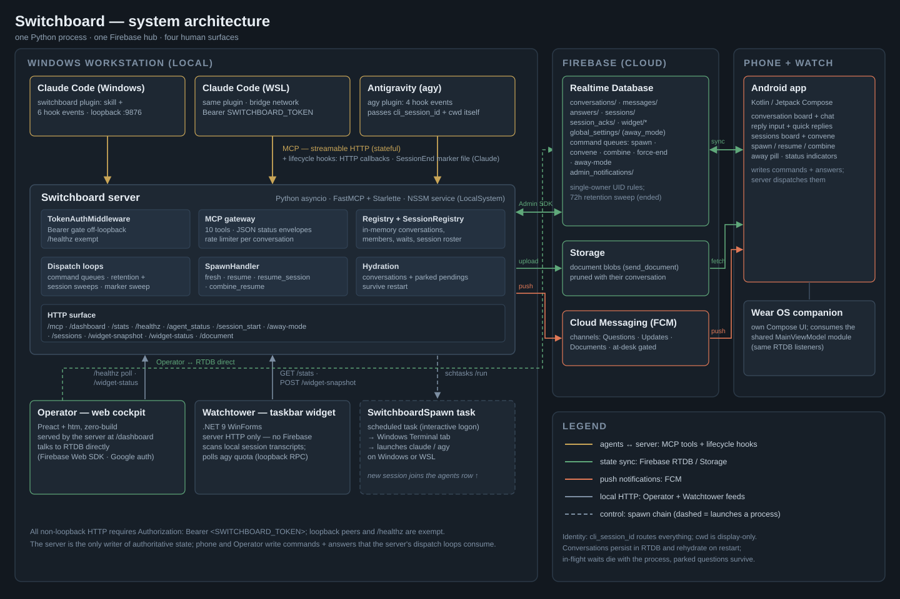

# Switchboard — Comprehensive Design Specification

Switchboard is a locally-hosted MCP gateway that lets AI agents (Claude Code, Antigravity) pause mid-task to reach the developer via a native Android app. Agents block on `ask_human`, fire `notify_human`, and deliver files via `send_document_human` while the developer is away from their desk; the developer answers from the phone and the agent unblocks. Multi-agent conversations are first-class — two or more agents collaborate through a unified `Conversation` primitive, regardless of which OS surface or working directory each one runs on.

This doc is the single design reference for the running system. Implementation files are the ultimate source of truth; the dated specs under `docs/superpowers/specs/` retain the historical reasoning and are no longer authoritative for current behavior.

---

## 1. Architecture



**Components.**

- **MCP server** (Python 3.11+, FastMCP with `stateless_http=False`). Serves the `/mcp` streamable HTTP transport on `127.0.0.1:9876` by default (`SWITCHBOARD_HOST` defaults to `127.0.0.1`; set to `0.0.0.0` for WSL-reachable; `SWITCHBOARD_PORT` defaults to `9876`). Plus nine added HTTP endpoints — health, hook callbacks, the widget/status feeds Watchtower and the phone read, the session roster, and a document proxy (§5) — and a `/dashboard` static mount, all behind a shared Bearer-token gate.
- **Firebase Realtime Database** — the persistence and phone-side synchronization surface. The server writes; the Android app reads + writes replies.
- **Firebase Cloud Messaging (FCM)** — delivers push notifications. Three channels (Questions / Updates / Documents), but only two distinct notification priorities — Updates and Documents share the default importance/priority (§12.6).
- **Android app** (`android/app/`), Wear OS app (`android/wear/`), and a shared library module (`android/shared/` — Firebase listeners, command writers, and pure policy consumed by both) — the human surface. Kotlin/Compose. Notifications, conversation list, sessions board, conversation view, reply input, spawn/resume/combine dialogs, away pill (§12).
- **Operator** (`dashboard/`) — a zero-build Preact+htm web cockpit the server mounts at `/dashboard` and serves alongside the MCP/HTTP surface; talks to Firebase RTDB directly.
- **Watchtower** (`watchtower/`) — a Windows taskbar widget (.NET) that pushes context-ring and quota telemetry to `POST /widget-snapshot` and renders the same data locally.
- **Plugin-bundled hooks** — six Python hook scripts (`scripts/`), wired across six hook events as nine handler entries in `hooks/hooks.json` (§6). They inject routing data, record session birth/death, gate turn-end, deny the built-in AskUserQuestion tool while away, and write agent-status. Antigravity (agy) sessions are covered by a separate two-script hook pair wired outside this plugin (§6).
- **NSSM Windows service** — wraps the Python server as a persistent background process. Runs as **LocalSystem** by default (`scripts/install-service.ps1`); the interactive-window need for spawn is met by the separate SwitchboardSpawn scheduled task, not by the service's own account.
- **SwitchboardSpawn scheduled task** — launches `wt.exe` (Windows Terminal) tabs running `claude` or Antigravity (`agy`) on either the Windows surface (PowerShell, base64-encoded command) or WSL (a versioned static launch script, §9.2). Registered with an interactive logon type so it can open visible windows regardless of which account the service runs under.

---

## 2. Conversation model

A `Conversation` is the persistence + routing unit, identified by a server-minted `conv-<uuid>` string (a `conv-` prefix over a UUID4 hex digest — not a bare UUID4). It carries title, lifecycle state, member rosters (active and departed), a message log, a wait queue, and display metadata; pending questions are not stored on the Conversation itself — the live index is `Registry._pending`, keyed by `(conversation_id, cli_session_id)`, alongside a second, independent index `Registry._background_pending` under the same key shape holding each session's one non-blocking `ask_human` (§4). The two never supersede each other; every counting and lifecycle accessor on `Registry` (`find_by_request_id`, `resolve`, `pop_record`, `all_pending`, `pending_for_conversation`, `expired_parked`, `parked_count`, `pending_count`, `oldest_pending_age_seconds`) reads the union, so background asks are counted, drained, and TTL-swept exactly like parked ones. All in-memory state lives in `server/registry.py:Conversation`; substantially more than title/lifecycle/members mirrors to Firebase under `/conversations/<id>/` — meta fields, badge counters (`unread_count`, `pending_responses`), and per-member/per-question subtrees (`pending_questions/`, `agent_status/`), per §10's full schema — messages live separately at `/messages/<id>/` and answers at `/answers/<id>/<request_id>/`.

### 2.1 Conversation states

- **Active** — accepts members. Joining paths: `join_conversation` with a `ref` (rejoins a bound caller, or targets a named existing conversation), `join_conversation` without a `ref` (subject to the candidate rule in §2.4), `combine_conversations` (migrates a source conversation's members into this one), spawn-into-existing (a phone/Operator spawn command targeting an existing conversation instead of minting one), convene (§10's `convene_commands.target` schema note covers the lazy-mint mechanics; §7 covers convene wakes), and resume (a departed member's session relaunches into a new continuation conversation). A freshly spawned conversation can briefly be Active with zero members — `handle_fresh` binds the new session before its member record exists — so "at least one member" does not hold at every instant.
- **Ended** — terminal. No active or dormant members. Persists in Firebase as history until pruned after `SWITCHBOARD_CONVERSATION_RETENTION_HOURS` (along with its messages and answers); not loaded into the in-memory registry on restart.

A conversation transitions to Ended on any of:

1. **Last-member leave.** The last alive member calls `leave_conversation` and no dormant members remain.
2. **Force-end.** John or Switchboard Operator force-ends the conversation from the phone (Page A swipe-right or long-press → End) or the dashboard; membership is cleared and the conversation ends immediately, regardless of how many members it still has.
3. **Combine source.** `combine_conversations`'s source conversation always ends once its movable members have migrated to the target, even if it retains permanently-lost members left behind for visibility.
4. **Emptied by migration.** A conversation ends if migrating a member out of it — via a bound caller's ref-form `join_conversation`, via convene, or via resume draining every remaining member into a new continuation conversation — leaves it with no members at all.

A sole-alive member's `message_and_await_agent` no longer ends the conversation on its own. The caller instead parks on the wait queue until a peer joins and replies, the wait times out, or John convenes the conversation — see §7 for the wait machinery.

### 2.2 Member states

Each `ConversationMember` carries `cli_session_id`, `sender` (agent-supplied display name), `cwd` (informational), `surface` (`"windows"` | `"wsl"`), `joined_at`, `last_seen_seq`, plus two boolean state flags (`alive`, `session_lost_permanently`) — the remaining fields (`session_ended_at`, `session_end_reason`, `left_at`, `last_spoke_at`) are lifecycle metadata, not flags:

- **Alive** — `alive=True`, `cli_session_id` bound in `_session_to_conversation_id`. The agent process is running.
- **Dormant** — `alive=False`, `session_lost_permanently=False`. Reached when the CLI session ends cleanly (`SessionEnd` hook fires with a resumable reason), when Antigravity's silence sweep declares an unresponsive agy session presumed-dead (agy has no `SessionEnd` hook to fire one directly), or when a combine/resume relaunch attempt fails and the rollback marks the member dormant directly. The member is retained in `members_active` for potential revival via resume or combine.
- **Permanently lost** — `alive=False`, `session_lost_permanently=True`. `SessionEnd` fired with reason `clear` or `compact` — Claude rewrote or reset the session, so the CLI session is unrecoverable. Member is retained for visibility only; resume and combine skip these members.

### 2.3 Session-fallback rule

When a session is **removed** from a conversation (`leave_conversation`, force-end, or a stale-binding self-heal triggered from inside `ask_human` or a ref-less `join_conversation`; combine moves rather than removes), the session is not orphaned:

- **If `global_away_mode == True`** — the session re-binds to its **home conversation**, set on first switchboard contact and persisted in `_session_home_conversation_id`. If the home is still Active, only the session's routing rebinds to it — membership itself is healed lazily the next time the session makes a tool call, not recreated here. If the home is Ended, the server mints a fresh Active conversation and updates the session's home pointer.
- **If `global_away_mode == False`** — the session becomes unbound. Subsequent `ask_human` / `notify_human` calls fall through to the at-desk redirect (§8.1); the agent's output reaches the developer via the terminal.

Combine is exempted from session-fallback — it migrates members from source to target rather than removing them.

### 2.4 Ref-less join candidate rule

A ref-less `join_conversation(sender, cli_session_id, cwd)` call (no `ref` argument) has to decide, without a name to go on, whether the caller is meeting a peer who is already waiting or starting alone. The candidate rule (`_find_join_candidate` in `server/conversation_ops.py`) answers this from conversation shape rather than identity: it scans `registry.conversations` for Active conversations that were themselves minted by a prior ref-less join (`origin == "join"`), still have exactly one alive member, and were created less than `JOIN_CANDIDATE_WINDOW_SECONDS` (1800 seconds, i.e. 30 minutes) ago. If exactly one such conversation exists, the joiner lands in it, pairing the two agents. If zero or several exist, the rule refuses to guess and the caller mints a new conversation instead.

The rule only runs for a caller that is genuinely unbound. A caller already bound to an Active conversation rejoins that conversation directly without consulting the candidate rule at all; a caller bound to a conversation that has gone Ended or gone missing is first self-healed through `apply_fallback` (the same mechanism `ask_human`'s stale-binding guard uses), and only then falls through to the candidate rule if the fallback left it unbound.

This is why a ref-less join sometimes lands two agents in the same conversation and sometimes doesn't: the rule is deliberately conservative, matching only a still-solo, recently-minted room, so that two unrelated ref-less joins arriving within the same 30-minute window don't get silently paired together.

### 2.5 Convening

Convening is the John-initiated membership path — the operator pulls chosen sessions into one conversation from the outside, without any agent calling a tool. From the phone's sessions board (§12.8) or the Operator dashboard, John multi-selects sessions; the client writes a `convene_commands/<push_id>` record (§10) carrying the `session_ids` and a `target` of either `"new"` or an existing conversation id, and `dispatch_convene_commands` (in `server/gateway/dispatch.py`) hands it to `_perform_convene` (in `server/conversation_ops.py`).

A `"new"` target is minted lazily: the conversation id is reserved up front — a resume prompt must embed a real id before the fallible launch — but the `Conversation` itself (origin `"convene"`, default title `Convened <n> agents`) is materialized only once a session actually routes in, so an all-skipped or all-failed convene leaves no orphan empty Active conversation. An existing target must be Active; otherwise every session is skipped with reason `target not found or not Active`.

Each selected session resolves against the session registry into exactly one outcome:

- **No registry record** — skipped (`not a live session`).
- **Terminal (`ended`/`lost`)** — relaunched via `launch_resume_agent` (the `resume_session` spawn type, §9.1; explicitly away-mode-free) with a convene-by-resume prompt telling the agent to `join_conversation(ref=...)` on arrival; membership is added immediately after a successful launch. Skipped when no spawn handler is wired, the record has no cwd, or the launch fails.
- **Alive and unbound, or bound to a conversation that no longer exists** — added as a member of the target.
- **Alive and already bound to the target** — membership ensured in place; nothing moves, but the session is still included in the wake.
- **Alive and bound elsewhere with no other alive member there** — migrated into the target; the source conversation ends if the migration empties it (§2.1). Dormant peers left behind keep the source Active.
- **Alive and bound elsewhere with alive peers** — skipped (`in a multi-party conversation`); convene never pulls a member out of a live multi-party collab.

If anything convened or is resuming, a `system` intro message (`John convened: ...`, with resuming and skipped detail) is appended to the target — the transcript explains itself, and the intro doubles as the documented backstop for any lost wake notice. An all-skipped convene appends nothing and instead sends John a phone notice explaining why nothing happened.

Each convened session then learns about it through whichever structure it is blocked in right now: a parked `message_and_await_agent` resolves immediately with the `{"status": "convened", ...}` envelope, a pending `ask_human` gets a convene notice prepended to John's eventual reply, and any other session gets a hook-delivered notice mid-turn or at its next turn boundary (§2.6, §6). The wake mechanics (`_wake_convened`) are documented with the rest of the wait machinery in §7.

### 2.6 Inbound human-to-agent delivery

Two features share one mechanism: John's free-form messages into a live conversation, and the answers to non-blocking `ask_human(background=true)` calls (§4). Both are inbound payloads for an agent that may not be sitting in a wait, which is the hard half either way.

**Command path.** The phone and Operator push `{conversation_id, text, issued_at}` to a top-level `message_commands/<push_id>` queue (§10), following the exact pattern of `combine_commands` and `force_end_commands`. A supervised `dispatch_message_commands` loop (`server/gateway/dispatch.py`) consumes it with the shared command listener, so it inherits freshness gating (a "stop everything" queued before a restart never fires stale), delete-on-dispatch, and `/healthz` registration. Delivery failures re-raise after reporting, which is what makes the listener skip the delete so the entry replays on the next restart — the queue is at-least-once by construction. An unknown or Ended conversation gets phone feedback via `send_text` and the command is dropped. There is no rate limit on this queue (it is human-paced, like answers), and FCM push is suppressed on John's own message since he authored it.

**The ladder.** `server/inbound.py` holds the shared delivery unit: `deliver_human_message` for the conversation-wide case and `deliver_background_answer` for the session-directed one. The message is appended to `conv.messages` as a `"human"`-type entry from sender `"John"` and mirrored to `/messages/<conv_id>`, then each live member is delivered to on **exactly one rung**:

1. **A live blocking `ask_human`** resolves through `terminate_pending`, framed `[John interjected - not a direct answer to your question] <text>` — any notices already attached to that pending are folded in ahead of it. The phone card cancels and the agent may re-ask. Note this deliberately *interrupts* rather than queueing behind the question.
2. **A `wait_queue` entry** is woken, carrying the message in its normal delta payload. A human message wakes **every** waiting live member (`_wake_all_from` in `server/conversation_ops.py`), because it addresses the room; a background *answer* wakes only its own session's entry, because it is session-directed.
3. **Otherwise** a session notice is queued (`session_registry.queue_notice`) framed `John (from phone): <text>`, delivered mid-turn by the `PostToolUse` hook or at a turn boundary / next prompt (§6).

Dormant and lost members get nothing live; the message is in history and reaches them on resume or re-join. The whole ladder and every conversation mutation run under `conv.lock`, with Firebase cancels issued after the lock is released.

**Known limitation, accepted.** A fully idle at-desk agent sees its queued notice only at its next prompt, because no mechanism exists to wake an idle session (§15). In away mode the window is narrower but no longer closed: since the `pending_ask` gate (§8.2), an agent can rest with its turn ended while a live blocking ask awaits John, and a notice queued during that sleep is delivered only when the ask resolves (John's reply re-invokes the agent via the backgrounded call; the notice pops at the following Stop) or times out.

---

## 3. Routing

The routing key is **`cli_session_id`**. For Claude Code, it is the session id Claude Code assigns per session, injected into every `mcp__switchboard__*` call by the `cli-session-injector-hook.py` PreToolUse hook: the hook reads `session_id` and `cwd` from the hook-event input JSON and copies them into the tool's arguments (Claude Code's `updatedInput` field replaces the original arguments rather than merging with them, so the hook must carry every original field forward itself, not just add the two routing fields). A Claude Code agent never knows or supplies its own session id — it only passes `sender` and tool-specific arguments.

Non-Claude agents have no such hook. Antigravity ("agy") sessions pass `cli_session_id` (their agy conversation UUID) and `cwd` (their first workspace path) explicitly inside every switchboard tool call's arguments; the `@require_cli_session_id` decorator accepts an explicitly-supplied id exactly as it accepts an injected one, so no separate code path is needed. The agy hooks are what make agents comply: `PreInvocation` teaches the requirement on every turn with an ephemeral system message, and `PreToolUse` denies any switchboard tool call whose arguments don't carry the caller's own `cli_session_id`, returning a corrective reason that restates the exact values to add.

Calls missing `cli_session_id` are rejected at the MCP boundary by the `@require_cli_session_id` decorator with:

```text
ERROR: cli_session_id required. Claude Code: this call arrived without the switchboard plugin's PreToolUse hook injection (plugin missing or stale). Other CLIs (e.g. Antigravity): retry the same call with cli_session_id=<your conversation id> and cwd=<your workspace root> added inside the tool arguments.
```

The agent-supplied `cwd` is **informational** — used for display (Android conversation row, member roster), for surface inference (`wsl` if `cwd` matches `/mnt/<letter>/...` or starts with `/home/...`; `windows` otherwise), and as a secondary lookup key (`lookup_conversation_ids(cwd_filter=...)`, and as the launch `project_path` for resume/spawn) — never for routing decisions. Two agents at the same physical directory or at different directories collab cleanly regardless of how they spell their cwd.

`Registry` carries two routing maps:

- `_session_to_conversation_id: dict[cli_session_id, conversation_id]` — the primary routing lookup.
- `_session_home_conversation_id: dict[cli_session_id, conversation_id]` — the session-fallback target per §2.3.

`bind_session` also mirrors into the `SessionRegistry` (`sessions.set_binding(...)`), which is the session-roster surface Operator, Android, and Wear actually read.

---

## 4. MCP tool surface

Ten tools, all decorated with `@require_cli_session_id`. Every tool accepts its own agent-facing arguments plus `cli_session_id` and `cwd` — hook-injected for Claude Code, explicitly supplied by the calling agent for Antigravity and other non-Claude CLIs (§3 covers the routing mechanics for both). `_touch_sessions` runs underneath every one of the ten: it upserts an unseen `cli_session_id` into the `SessionRegistry` and refreshes that session's `SessionRecord.cwd` (and re-infers `surface`) on every call, self-healing a missed `SessionStart` hook — the `ConversationMember.cwd` (§2.2) is untouched here; it's set only at member-add/migrate time. Subsections below are ordered as `server/main.py` registers the tools.

**Return contract.** The conversation-facing tools return one-line JSON status envelopes built by `_envelope` / `_terminal_envelope` / `_wrap_wait_result` in `server/gateway/handlers.py`. The full set of `status` values the code emits:

| status | meaning |
|---|---|
| `ok` | the call completed normally |
| `timeout` | a blocking wait expired |
| `superseded` | a newer call from the same session replaced this one's pending wait (see Supersession, below) |
| `conversation_ended` | the conversation the caller was in ended out from under them; carries a `cause` field — observed values are `"force-ended"`, `"merged into target"`, `"combined into <target_id>; re-ask your question there"`, and the default `"ended"` |
| `convened` | John convened the conversation from the phone while the caller was parked in `message_and_await_agent` (§7) |

`ask_human` is the exception: on success it returns John's bare reply text, not an envelope. Only its terminal states — `timeout`, `superseded`, `conversation_ended` (including a pre-flight self-heal off a stale binding to an already-Ended conversation, which resolves without ever registering a pending) — come back enveloped; its failure modes are plain `ERROR: ...` strings. Its `background=true` mode is the one case where a *successful* `ask_human` returns an envelope (`{"status": "pending", "request_id": ...}`), because there is no reply to return yet.

**`peers` objects.** One entry per other active member of the conversation: `{"sender", "state": "alive"|"dormant", "waiting": bool, "last_spoke_at": float|null}`. `waiting` is derived live from unresolved wait-queue entries and means "a message sent now would wake them," not "idle." Carried on `message_and_await_agent`'s wake, `post_agent_message`, `join_conversation` (including `peers=[]` on the ref-less mint branch), and convene wakes; terminal envelopes (`timeout`, `superseded`, `conversation_ended`) never carry `peers`.

**Rate limiting.** `ask_human`, `notify_human`, and `send_document_human` consume from a per-conversation token bucket (`RateLimiter(config.rate_limit)`, default 30 messages/minute via `SWITCHBOARD_RATE_LIMIT`, refilling continuously) and reject outright when it's empty:

```text
ERROR: rate limit exceeded — you are sending too fast.
Limit is <rate> messages/min per conversation.
Wait at least <n> seconds before retrying, or slow your notify cadence.
```

`message_and_await_agent` and `post_agent_message` draw from the same bucket but degrade instead of rejecting: the message still writes and still wakes peers, only the FCM push is suppressed, so a fast collab exchange never breaks the wake protocol. `join_conversation`, `combine_conversations`, `lookup_conversation_ids`, `leave_conversation`, and `set_away_mode` are not rate-limited.

### `ask_human(question, sender, title?, format?, suggestions?, background?)` — blocking, or non-blocking with `background=true`

Sends a question to John's phone; blocks for `SWITCHBOARD_TIMEOUT_SECONDS` (default 86400 = 24h; this tool has no caller-settable timeout) or until John replies. If the caller's session isn't bound to a conversation, the server auto-mints one first and routes the question through it.

**At-desk redirect.** When away mode is off, the call short-circuits: the question is written to Firebase as a `notify`-type message (so it still surfaces on the phone as a passive notification), and the tool returns the literal string `"ERROR: John is at his desk. Ask this question via the terminal."` The agent's expected response is to surface the question content verbatim in the terminal.

**`background=true` — the non-blocking mode.** Runs the same validation, conversation resolution, sender canonicalization, and rate-limit consumption, then writes the question card and returns `{"status": "pending", "request_id": ...}` immediately instead of awaiting a future. The pending it registers is deliberately future-less (`Registry.add_background`), living in a **second slot** keyed like `_pending` but independent of it, so the blocking and background slots never supersede each other (§2, §7). A second background ask from the same session **appends** to the existing card rather than opening a new one: the question text grows, the original `request_id` is kept and returned again, and one reply resolves the whole slot. John's eventual answer is delivered through the shared inbound ladder in `server/inbound.py` (`deliver_background_answer`) rather than by resolving a future — see §2's inbound-delivery subsection. At desk it takes its own redirect with a **deliberately different literal**, `"ERROR: John is at his desk. State your question in the terminal and continue working."`, whose instruction differs from the blocking form: the agent states the question in the terminal and keeps working rather than converting it into a blocking terminal ask. A pending background ask does **not** satisfy the away-mode turn-end hook, which still requires a turn to end on a blocking ask (§8) — though a live blocking ask whose MCP call the harness has moved to a background task **does** satisfy it via the `pending_ask` gate (§8.2). The backlog's hoped-for "new legal idle state" was resolved by interruption instead, since a background answer punches through a live blocking ask via the ladder's first rung.

`format`: `"plain"` (default) or `"markdown"`, forwarded unvalidated. `suggestions`: optional list of quick-reply strings rendered as tap-to-respond chips; a value that isn't a JSON array of strings is rejected with:

```text
ERROR: suggestions must be a JSON array of strings, e.g. ["Yes", "No", "Ship it"]. Got: <reason>. Re-call ask_human with the corrected shape, or omit suggestions.
```

**Supersession.** A second `ask_human` from the same session in the same conversation supersedes the first: the earlier pending's future resolves with `SUPERSEDED_SENTINEL` (`server/registry.py`, surfacing to that earlier call as `{"status": "superseded"}`), and its phone card is cancelled. The new call is minted its own fresh `request_id` — nothing is taken over; only the pending-map key `(conversation_id, cli_session_id)` is reused.

Cancelling the call from the terminal shields the Firebase cleanup so the question's `cancelled` flag still gets set correctly; this tool and `message_and_await_agent` are both wrapped in a progress keepalive so an hour-long block survives MCP transport idling.

### `notify_human(message, sender, title?, format?)` — non-blocking

Writes a one-way notification. Auto-mints a conversation if the session is unbound. Unlike `ask_human`, the write is unconditional either way — away-mode state changes only the return string, never whether the notification is written or pushed.

Return contract: `"ok"` when away mode is on. When away mode is off the notification is still written and pushed, but the call returns `"ERROR: John is at his desk (notification delivered to phone anyway)."` so the agent learns to route remaining output to the terminal; a backend exception instead returns `"ERROR: <exception>"`.

### `send_document_human(path, sender, title?, caption?)` — non-blocking

Delivers a file to the phone. `path` may be absolute or relative to the caller's cwd, but either way must resolve to somewhere inside the caller's cwd — an absolute path that resolves outside it is rejected with `"Path escapes project directory: <path>"`. 5 MB cap. Two independent gates decide shareability: a denylist (`.env*`, `*.env`, `*token*`, `*secret*`, `*.pem`, `*.key`, plus the exact names `.env`, `service-account.json`, `credentials.json`) and an extension allowlist — only `.md .markdown .txt .log .csv .tsv .diff .patch .pdf .png .jpg .jpeg .gif .webp` are shareable, everything else (source, archives, HTML/SVG, JSON, extensionless files) is refused with `"File type '<ext>' is not on the shareable allowlist (...): <name>"`. Path traversal is rejected. **Not at-desk-gated** — documents always deliver regardless of away mode.

### `message_and_await_agent(sender, message, title?, timeout_seconds?)` — blocking

Speak to peers in your conversation and block until woken. `message` is required and non-empty: `"ERROR: message is required. The 'listen without speaking' use case is join_conversation()."` An unbound caller gets `"ERROR: not in any conversation. End your turn."`

`timeout_seconds` is the only caller-settable timeout on this surface: optional, clamped to `[10, config.timeout_seconds]` (if the configured ceiling itself is below 10 seconds, the ceiling wins), and defaults to the full ceiling when omitted. The float coercion runs after conversation/member resolution and rate-limit consumption but before the wait entry is queued, so a garbage value still fails before anything is left parked on the queue.

The caller's speak event is appended to the conversation log, any of the caller's own still-parked waits in the same conversation are superseded first (their futures resolve with `SUPERSEDED_SENTINEL`, without advancing `last_seen_seq` since the sentinel carries no delta), the FIFO-oldest existing waiter is woken, and only then does the caller queue onto `conv.wait_queue` and block — §7 covers the queue mechanics and wake order in full.

**Park-when-alone.** There is no auto-leave for a sole-alive speaker. Waking an empty queue is a no-op, so a caller with no peers simply parks — until a peer joins and replies, the wait times out (`{"status": "timeout"}`), or John convenes the conversation from the phone (`{"status": "convened", ...}`). Nobody is removed from `members_active` and the conversation does not end.

On a normal wake, returns `{"status": "ok", "conversation_id": ..., "log": <delta since last_seen_seq, own emissions excluded>, "peers": [...]}` (see `peers` objects, above). `title`, when supplied, updates `conv.title`.

### `post_agent_message(sender, message, title?)` — non-blocking

The non-blocking sibling of `message_and_await_agent`: same unbound-caller error (`"ERROR: not in any conversation. End your turn."`) and its own, shorter empty-message error (`"ERROR: message is required."`, without the `join_conversation()` pointer), but the caller writes and returns immediately instead of queuing. Wakes the FIFO-oldest waiter, explicitly excluding the caller's own parked wait, so posting a message never cancels a wait the same session is already sitting on. Returns `{"status": "ok", "conversation_id": ..., "msg_id": ..., "log": ..., "peers": [...]}`, plus `"write_failed": true` in the rare case peers were woken but the phone-history write itself failed — the caller should not re-post in that case.

### `combine_conversations(source_id, target_id)` — non-blocking

Move every movable member of `source_id` into `target_id`; the source conversation always ends once its movable members have migrated.

- **Alive members** rewire `_session_to_conversation_id` to the target and move in-place (an inline move distinct from the `join_conversation` migrate path).
- **Dormant members** are queued for resume: a spawn-pending file (`type="combine_resume"`) fires `claude --resume <session_id>` (or the member's own registered CLI) per member. The member is optimistically flipped alive and moved into the target at combine time, rolled back to dormant if the launcher invocation fails. If any dormant member needs a relaunch and nobody is logged into the desktop, the whole combine aborts up front: `"ERROR: combine aborted: dormant member(s) {names} need a relaunch but no one is logged in to the desktop. Sign in (locally or via RDP) and try again."`
- **Permanently lost members** stay behind in the now-Ended source's `members_active` for visibility — never moved, never appended to `members_history`.

Returns `{"status": "ok", "source": ..., "target": ..., "detail": ...}` on success, or a bare `ERROR: ...` string on validation failure.

### `join_conversation(sender, ref?, title?)` — non-blocking

Never blocks; idempotent. With no `ref`, an already-bound caller rejoins its own bound conversation; an unbound caller follows the ref-less candidate rule (§2.4), and a caller whose binding is stale (pointing at a conversation that has gone Ended or missing) is first self-healed via the same fallback `ask_human` uses, before the candidate rule runs. With a `ref` (a conversation_id, typically from `lookup_conversation_ids`), the caller migrates into the named conversation, and unseen history since `last_seen_seq` is delivered synchronously in the response — there is no separate blocking call to catch up on history; the ref form does not consult the stale-binding self-heal.

Returns `{"status": "ok", "conversation_id": ..., "sender": ..., "peers": [...], "log": ..., "already_member": true}` — `already_member` is present only when the caller was already a member of the target conversation, omitted otherwise. On the ref-less mint branch (no candidate found), the response instead carries `"minted": true` with `"peers": []`; `minted` never appears as `false`.

### `lookup_conversation_ids(cwd_filter?, sender_contains?, title_contains?)` — non-blocking

Returns an `ok` envelope carrying one metadata row per matching Active conversation: `{"status": "ok", "conversations": [{conversation_id, title, last_activity_at, created_at, origin, members: [{sender, state}]}]}`, `state` being `"alive"` or `"dormant"`, sorted by `last_activity_at` descending. At least one filter is required, and a match must satisfy all supplied filters — `cwd_filter` is an exact case-insensitive match against a member's cwd, while `sender_contains` and `title_contains` are case-insensitive substring matches. Iterates `registry.conversations` in memory only, so Ended conversations never appear. Used to pick a concrete conversation before calling `join_conversation(ref=...)` or `combine_conversations`.

### `leave_conversation(sender, parting_message)` — non-blocking

Explicit leave. Appends a `parting`-type message to the conversation log; removes the caller from `members_active`; appends to `members_history` with `left_at = now()`; wakes the FIFO-oldest waiter with the parting in their payload; applies the session-fallback rule (§2.3). If the caller was the sole alive member and no dormant members remain, the conversation transitions to Ended. Returns `{"status": "ok", "conversation_id": ...}`.

No "cannot leave in away mode" guard — the session-fallback rule covers the orphan-prevention case.

### `set_away_mode(value)` — non-blocking

`value` must already be a `bool`; a non-bool is rejected outright with `"ERROR: value must be a boolean"` rather than coerced. Sets `registry.global_away_mode` and mirrors it to Firebase at `/global_settings/away_mode`. Turning away mode off additionally drains every pending question held in memory: the flag flips first (so a racing `ask_human` already takes the at-desk redirect), then every outstanding pending is bulk-resolved with `"John is back at his desk; your question was not answered remotely. Re-ask in the terminal."` Returns `"ok. away_mode=False (<n> pending question(s) resolved with the at-desk notice)"` when turning off with at least one pending resolved, `"ok. away_mode=<value>"` otherwise (turning on, or turning off with nothing to resolve), or `"ERROR: away_mode set in memory but Firebase persist failed: <exc>"` if the Firebase mirror write fails. The agent calls this in response to "I'm stepping away" / "I'm back" signals from John. Spawn-from-phone auto-enables away mode on dispatch (§9), so spawned agents typically don't need to set it themselves.

---

## 5. HTTP endpoints

Nine added routes, plus the `/mcp` transport and a static mount, all wrapped once by `TokenAuthMiddleware` (`server/main.py`):

| Route | Method(s) | Purpose | Token gate |
|---|---|---|---|
| `/mcp` | POST/GET (streamable HTTP + SSE) | The MCP tool surface (§4). Stateful sessions (`stateless_http=False`). | Gated (loopback exempt) |
| `/healthz` | GET | Liveness + per-loop supervisor status; pending-question counts. | **EXEMPT** — the sole path-based exemption |
| `/widget-snapshot` | POST | Watchtower pushes context rings + Antigravity quota; store diffs and writes RTDB only on change, and feeds the SessionRegistry. | Gated; rate-limited |
| `/widget-status` | GET, POST | Drives the server-owned Claude/Antigravity status watch (`?target=`, `?action=check\|stop`). | Gated |
| `/away-mode` | GET, POST | GET returns `{"active", "notices", "pending_ask"}` — a `session_id` query param **pops** that session's queued wake notices as a side effect, and sets `pending_ask` true when the session's conversation holds a live blocking ask (`Registry.live_blocking_pending`; parked and background pendings excluded). POST (body `active`/`away`, default `True`) turns away mode **on** and mirrors to Firebase; there is no HTTP way to turn it off (only `set_away_mode(False)` or the phone). | Gated |
| `/stats` | GET | Widget/Watchtower roll-up: `active_conversations`, `pending_count`, `oldest_pending_age_seconds`, `away_mode`, `healthy`, `sessions{total,by_state}`, `needs_you{}`. | Gated |
| `/document` | GET | Same-origin blob proxy for the Operator document preview (`?conv=&msg=[&download=1]`); forces `application/octet-stream` for HTML/SVG/XML and sets `X-Content-Type-Options: nosniff`. | Gated |
| `/session_start` | POST | SessionStart hook ingest (`session_id`, `cwd`, `source`); records the session birth; always returns 200 (hook contract). | Gated; rate-limited |
| `/sessions` | GET | The session roster as JSON, with `cli_session_id` redacted to an 8-char prefix. | Gated |
| `/agent_status` | POST | Hook status ingest: `{session_id, state, event, cwd?, detail?}`. Upserts the SessionRegistry **before** the away-mode gate (so the roster updates at-desk too), then writes/deletes `conversations/<id>/agent_status/<sender>` — gated on away mode, except `state == "clear"` always deletes. Returns `{"notices": [...]}` on `UserPromptSubmit`, and also on `PostToolUse` **except from an Antigravity caller** (`cli == "antigravity"`), which is what makes mid-turn notice delivery possible for Claude Code without destroying it for agy: the pop is destructive and at-most-once, and agy's own `PostToolUse` hook discards the response body, so popping for agy would bin the notice with no error and no log. The pop sits after the status handler, outside the away-mode gate. | Gated; rate-limited |
| `/dashboard` (mount) | GET (StaticFiles, `html=True`) | Serves the Operator cockpit (`dashboard/`). | Gated |

**Auth model.** `/healthz` is the only path exemption; loopback peers (`127.0.0.1`, `::1`) are exempt on every path regardless of bind; a `401 {"error": "unauthorized"}` covers everything else. A non-loopback bind without `SWITCHBOARD_TOKEN` is a hard startup failure (`ConfigError`, fail-closed), so the ungated configuration cannot reach uvicorn.

**Rate limiting.** `/widget-snapshot`, `/session_start`, and `/agent_status` share a coarse per-route token bucket (`SWITCHBOARD_ROUTE_RATE_LIMIT`, default 600/min per route) returning `429` when exceeded — separate from the per-conversation tool limiter in §4/§15.3.

---

## 6. Plugin hooks

Six Python hook scripts, wired across six hook events as nine handler entries in `hooks/hooks.json` (order below is the file's own order, by each script's first appearance). Every command is `python <script>`, and every timeout is load-bearing: a killed hook's output is silently discarded. Three entries run at `>=15s` (turn-end, injector, guard), but only the injector and the guard scripts carry explicit warnings against shortening their timeout — the turn-end hook's 15s timeout is equally load-bearing but carries no such warning.

| Hook | Event(s) | Purpose |
|---|---|---|
| `turn-end-hook-away-mode.py` | Stop (`--cli claude`, timeout 15) | Calls `GET /away-mode`. Emits `{"decision": "block", ...}` when away mode is on and the session holds no live blocking ask; when the response's `pending_ask` is true it exits silently — the live ask is the turn's handback (§8.2 covers the rationale, the exact literal, and the two other CLI shapes). It also blocks with queued-notice text even when away mode is **off**, a second job the name doesn't suggest. An unrecognized `--cli` value exits silently, so the flag is required. |
| `agent-status-hook.py` | Stop, UserPromptSubmit, PreToolUse, PostToolUse (timeout 10 each) | POSTs `{session_id, state, event, cwd?, detail?}` to `POST /agent_status` to surface "thinking" / "tool:X" indicators on the phone (§5 covers the route's away-mode gating and notices semantics). On `UserPromptSubmit` it also consumes the response, writing any popped notices to stdout as turn context. On `PostToolUse` it consumes the response too and, when notices came back, emits `{"hookSpecificOutput": {"hookEventName": "PostToolUse", "additionalContext": "<notices>"}}` on stdout — the documented PostToolUse channel for reaching the model mid-turn, and the only mid-turn injection path (§15). The two stdout shapes are deliberately different (raw text for `UserPromptSubmit`, a JSON envelope for `PostToolUse`); `Stop` and `PreToolUse` still emit nothing. Editing this script requires a `.claude-plugin/plugin.json` version bump or the version-gated plugin cache keeps serving the old copy. |
| `cli-session-injector-hook.py` | PreToolUse (timeout 15) | Self-filters on `tool_name.startswith("mcp__switchboard__")`. Reads `session_id` and `cwd` from the hook payload and merges them into the tool's input via `hookSpecificOutput.updatedInput` — which **replaces** the input, so the hook explicitly carries forward every original `tool_input` field. This is Claude Code's own routing path; non-Claude CLIs pass `cli_session_id`/`cwd` explicitly instead (§3). **Stdin must be read as raw bytes** (`sys.stdin.buffer.read()` + `json.loads(bytes)`) — `json.load(sys.stdin)` uses a TextIOWrapper that on Windows defaults to cp1252+surrogateescape and mangles UTF-8 into surrogate codepoints. Deliberately does not share `_hook_common.py` with the other five hooks. |
| `away-mode-tool-guard-hook.py` | PreToolUse, `matcher: "AskUserQuestion"` (timeout 15) | Denies the built-in `AskUserQuestion` tool while away mode is on, redirecting the agent to `ask_human` with `suggestions`. Deliberately omits `session_id` from its `/away-mode` query so it does not steal the session's queued notices. |
| `cli-session-end-hook.py` | SessionEnd (timeout 10) | Writes a SessionEnd marker FILE under `SWITCHBOARD_MARKER_DIR` (atomic temp + `os.replace`), which the server's `dispatch_session_end_markers` loop sweeps to mark the member dormant (the marker file wins the process-exit race a synchronous POST loses; see §13.3). Fires on orderly Claude exit (`/exit`, Ctrl+D, terminal closed); does NOT fire on SIGKILL / BSOD / network loss. The session sweep (§14, §15.1) still marks such a session lost in the roster after `SWITCHBOARD_SESSION_LOST_AFTER_SECONDS`, but member-dormancy propagation from that sweep is Antigravity-only (§2.2) — a Claude member left stale-alive this way needs force-end to clear. |
| `cli-session-start-hook.py` | SessionStart (timeout 10) | POSTs `{session_id, cwd, source}` to `POST /session_start`, recording the session's birth in the SessionRegistry; a missed birth self-heals on the first MCP call or agent-status event. |

`scripts/_hook_common.py` centralizes `read_stdin_json()`, `SWITCHBOARD_BASE_URL` (default `http://127.0.0.1:9876`), and `SWITCHBOARD_TOKEN` (sent as `Authorization: Bearer <token>`) for five of the six hooks.

**Antigravity (agy) hooks.** Wired outside the Claude plugin: the repo doubles as a native Antigravity plugin, and `agy plugin install <repo>` consumes the repo-root `hooks.json` manifest (alongside the root `mcp_config.json` and `skills/`) — distinct from the Claude plugin's `hooks/hooks.json`. Machines wired before the plugin restructure may still carry the equivalent chezmoi-managed `~/.gemini/config/hooks.json`; the hook set is identical either way. Four hook events across two scripts: `PreInvocation`, `PreToolUse`, and `PostToolUse` (`scripts/agy-identity-hook.py`), plus `Stop` (`scripts/turn-end-hook-away-mode.py --cli antigravity`, which posts its own idle status directly because agy's merge semantics for multiple `Stop` handlers are unverified). There is no agy equivalent of `SessionStart`/`SessionEnd`: birth self-heals from the first hook POST or MCP call, and death is caught only by the silence sweep (§14, §15.1), with no marker-file path. Because agy hooks cannot rewrite tool arguments (no `updatedInput` equivalent), identity is *taught* (`PreInvocation` ephemeral message) and *enforced* (`PreToolUse` denies a call whose `cli_session_id` doesn't match the caller's own) rather than injected — see §3 for the routing mechanics this replaces. Every agy status POST carries `cli: "antigravity"`, which is what lets spawn (§9) later pick the `agy` launch branch. The `AskUserQuestion` guard has no agy analog — that hole, and its fix, are Claude-specific.

---

## 7. The conversation wait queue (FIFO)

Each conversation carries exactly one wake structure, `wait_queue: collections.deque` (`Conversation.wait_queue` in `server/registry.py`). The sole entry-construction site is `message_and_await_agent`'s enqueue in `server/gateway/handlers.py`.

**Entry shape.** Each `wait_queue` entry is a plain dict:

| field | type | meaning |
|---|---|---|
| `member` | `ConversationMember` (live reference, not a copy) | the waiter; combine's in-place member migration depends on this being a reference |
| `future` | `asyncio.Future[str]` | resolved by whichever mechanism wakes the entry |
| `waiting_kind` | `str`, always `"msg_and_await"` | see below |
| `block_position` | `float` (`time.monotonic()`, set once at enqueue) | write-only — nothing in `server/` ever reads it |

Ordering is the deque's own insertion order (`append` at the tail, `popleft` from the head), not `block_position` — despite the field's presence, "FIFO" here means queue order, not sorted-by-timestamp.

**`waiting_kind` has exactly one value the code ever writes: `"msg_and_await"`.** `"enter"` is never a `waiting_kind` — no entry is ever constructed with it. It is the *other* mode `_compose_wake_payload` (below) accepts, passed as a direct literal on two synchronous callers that never touch the queue at all: `join_conversation`'s history delivery on a ref-join (in `handlers.py`) and `_wake_convened`'s pre-built envelope for a session pulled in by convene (in `conversation_ops.py`). Seeing only `"msg_and_await"` in a live entry does not mean `"enter"` is dead — it is simply never queued.

**`_wake_one_from(conversation, exclude_cli_session_id=None) -> bool`** (in `conversation_ops.py`) scans the queue from the head for the first live, non-excluded entry: dead entries (future already resolved by timeout or cancellation) are discarded along the way, and an entry belonging to `exclude_cli_session_id` is skipped but left in its original queue position rather than dropped. The first eligible entry gets its wake payload composed, its future resolved, and its member's `last_seen_seq` advanced to the current message count; the call returns `True`. Against an empty queue, or one holding only dead/excluded entries, it returns `False` and does nothing — this no-op is what park-when-alone (below) depends on.

**`_compose_wake_payload(conversation, member, kind) -> str`** (in `conversation_ops.py`) slices `conversation.messages[member.last_seen_seq:]` and formats one line per message — a parting as `"[<sender> left] <text>"`, a system message as `"[system] <text>"`, everything else as `"<sender>: <text>"` — joined with newlines; an empty slice composes to `""`. It never advances `last_seen_seq` itself. The mode governs only which messages survive the slice: `"enter"` (anything other than `"msg_and_await"`) keeps the full unseen history; `"msg_and_await"` keeps the same slice with entries whose `sender` matches the waking member's own `sender` filtered out, so nobody is woken by an echo of their own words.

**Ordering: a caller's self-supersession runs before the wake.** Inside `message_and_await_agent`, before `_wake_one_from` is called at all, the caller first scans `wait_queue` for its own still-live entry from an earlier, un-woken call in the same conversation, removes it, and resolves it with `SUPERSEDED_SENTINEL` (in `handlers.py`). Only then does it call `_wake_one_from(conv)` with no exclusion — the supersession loop has already cleared anything an exclusion would protect. Reversed, the wake would resolve the caller's own stale entry with the caller's own fresh message, and nothing downstream would catch the mistake. Because `SUPERSEDED_SENTINEL` carries no delta, `last_seen_seq` is deliberately left unadvanced on a supersession, so the owed history rolls forward onto the new wait rather than being lost. `post_agent_message` never enqueues, so it has nothing of its own for that same wake to disturb — but it still passes `exclude_cli_session_id` to the `_wake_one_from` call it triggers, to shield a wait its own session may already be parked on from an earlier `message_and_await_agent` call.

**`post_agent_message`'s wake-without-blocking** (in `handlers.py`): it appends its message, calls `_wake_one_from(conv, exclude_cli_session_id=cli_session_id)` to wake the FIFO-oldest waiter while shielding any wait its own session already holds, then composes its own unseen delta via `_compose_wake_payload(conv, caller_member, "msg_and_await")` and advances its own `last_seen_seq` — all without ever creating a future or touching the queue. A poster both delivers and collects in the same call.

**Park-when-alone.** A sole-alive speaker's `message_and_await_agent` call still runs `_wake_one_from` against an empty queue; that returns `False` and does nothing, so the caller simply enqueues itself and blocks — there is no separate "am I alone" check and no auto-leave. It parks until a peer's `message_and_await_agent` or `post_agent_message` wakes it, its own timeout fires, or John convenes the conversation from the phone. §2.1 and §4 both point back to this as the mechanism behind "a sole-alive member no longer ends the conversation on its own."

**Convene wakes.** `_wake_convened` (in `conversation_ops.py`), run at the end of a phone-initiated convene (flow: §2.5), handles each moved session by whatever it is actually blocked in right now:
- Blocked in `message_and_await_agent` — every conversation's `wait_queue` is scanned for the session's entry, which is removed and resolved with a pre-built `{"status": "convened", ...}` envelope (not a `_compose_wake_payload` string), and its member's `last_seen_seq` is advanced.
- Blocked in `ask_human` — a convene notice is appended to the pending's `notices`, which `Registry.resolve` later prepends to John's eventual reply text.
- Idle — a session notice is queued, delivered on the session's next turn-end hook poll (§8.2).

**Sentinels vs. envelopes.** The raw strings documented in this section — `SUPERSEDED_SENTINEL` and the `"__CONVERSATION_ENDED__\n(<cause>)"` family — are the internal wake-payload vocabulary: what actually gets set as a future's result when a wait or a pending is torn down. No agent ever observes them raw. `_terminal_envelope` (in `server/gateway/handlers.py`) translates each one into the `status`/`cause` envelope §4 documents, at the single MCP boundary rather than at each resolution site — deliberately, per its own docstring: translating there keeps every internal consumer (wait-queue drains, logs, tests of internals) on the stable string protocol instead of scattering the translation across every place a sentinel gets produced.

**Force-end drain.** `handle_force_end` (in `dispatch.py`) resolves every remaining `wait_queue` entry with `"__CONVERSATION_ENDED__\n(force-ended)"`, and — a separate step from draining the queue — terminally resolves every still-open `ask_human` pending in the conversation with the same literal, via `terminate_pending`. The whole handler is idempotent: a no-op if the conversation is already Ended.

**Session-end resolution.** `handle_session_end` (in `cli_session_end.py`) wakes every waiter on the conversation, not only the ending session's, each with its own full unseen delta — the dormancy system message rides along inside that delta rather than replacing it, except as a fallback when a waiter's delta would otherwise be empty. It then separately terminates only the ending session's own `ask_human` pendings: a live one is cancelled outright; a parked (future-less) one is left alone unless the session end is permanent (`clear` or `compact`), in which case it too is terminated.

**Combine migrates waiters instead of waking them.** A migrating member's `wait_queue` entry moves directly into the target conversation's queue — the live `member`/`future` references stay valid across the move — while only entries belonging to permanently-lost members left behind in the source are drained, with `"__CONVERSATION_ENDED__\n(merged into target)"`. Every open `ask_human` pending still in the source is separately terminated with its own sentinel naming the target conversation, mirroring force-end's two-structure treatment. Once the whole migration completes, combine wakes exactly one waiter in the target so a blocked agent there notices the merge.

**Parked future-less pendings, and the two things "parked" means.** This doc uses "parked" for two different mechanisms; they should not be conflated. A **parked wait** is a live `wait_queue` entry with nobody to wake it — it still holds a real `asyncio.Future` tied to the running event loop, and `wait_queue` is explicitly not rehydrated on restart, so a parked wait does not survive one. A **parked `PendingRequest`** (the `ask_human` side) is a different, sibling structure: `PendingRequest.future: asyncio.Future | None`, where `None` means parked, registered via `Registry.add_parked` with the same supersede semantics as a live pending but no coroutine awaiting it. Parked pendings are rebuilt from Firebase's `pending_questions` records on startup (`server/hydration.py`) — unlike a parked wait, a parked pending survives a service restart. John's eventual answer resolves one through `finish_parked_resolve`, which deletes the Firebase record and queues a session notice rather than setting a future result. A periodic sweep expires parked pendings older than `SWITCHBOARD_SESSION_RETENTION_HOURS` (default 72h — the same horizon session records use).

A **background pending** is the third variety and the only one created future-less while its session is alive: `ask_human(background=true)` registers it via `Registry.add_background` into the separate `_background_pending` slot (§2, §4). It shares the parked shape (`future is None`, rebuilt from `pending_questions` on restart, swept at the same 72h horizon, drained by the away-exit bulk drain) but differs in two ways: hydration routes it by the record's `background` flag, where **absence of the flag means blocking** — so pre-existing records rebuild exactly as before — and its answer is delivered by `deliver_background_answer` through the inbound ladder (§2) instead of `finish_parked_resolve`, which lets the answer resolve a live blocking ask or wake a wait rather than only queueing a notice.

---

## 8. Away mode

Single global flag at `registry.global_away_mode: bool`, mirrored at `/global_settings/away_mode`. Five things mutate it:

- The `set_away_mode(bool)` MCP tool (§4).
- Phone- or Operator-written `away_mode_commands/<push_id>/` records — `{"type": "enter_global", ...}` or `{"type": "exit_global", ...}` — consumed by `dispatch_away_mode_commands`; a stale entry older than the command TTL is dropped loudly rather than applied.
- Spawn dispatch auto-enabling away mode when launching an agent from the phone (§9).
- `POST /away-mode` — turns the flag on only; there is no off path through this route (a missing `active` body field defaults true, and a falsy value is simply a no-op).
- The Firebase RTDB listener on `/global_settings/away_mode` itself: it applies the persisted value on startup and applies any subsequent change to that same value straight into the in-memory cache via `Registry.update_global_away_cache` (`server/registry.py`) — the path through which the flag can change without going through any of the other four calls above.

### 8.1 At-desk redirect

When the flag is `False`:

- **`ask_human`** short-circuits before registering a pending: it writes the question to Firebase as a `notify`-type message (so it still surfaces on the phone as a passive notification) and returns `"ERROR: John is at his desk. Ask this question via the terminal."` — even a Firebase write failure still returns this sentinel. A second check re-applies after the pending is registered, in case away mode flips off mid-write: it withdraws the pending and returns the same string.
- **`notify_human`** is *not* gated the way `ask_human` is — the write is unconditional either way; only the return string differs. At-desk it returns `"ERROR: John is at his desk (notification delivered to phone anyway)."`; with away mode on, `"ok"`. This is routing guidance for the agent, not a delivery failure — the notification reaches the phone regardless of the flag.
- **`send_document_human`** always delivers regardless of the flag — away mode plays no part in it at all (§4 covers its other, unrelated failure modes).
- **`message_and_await_agent`, `post_agent_message`, `combine_conversations`, `lookup_conversation_ids`** are agent↔agent surfaces that read the flag nowhere — unaffected by away-mode state in either direction. **`join_conversation`** and **`leave_conversation`** are the exception: both can reach `apply_fallback` (§2.3) — join on its ref-less stale-binding self-heal, leave always — whose outcome (rebind-to-home vs. unbind) depends on `global_away_mode`.

**At-desk FCM gate** (2026-07-27, the change that suppresses most notifications when away mode is off). Independent of the per-tool behavior above, `FirebaseBackend.write_conversation_message` applies a second, message-type-level gate: when away mode is off, only messages of type `question`, `notify`, or `document` still push an FCM notification to the phone; every other non-`human` type — in practice `agent_msg`, `system`, `parting` — has its push suppressed. `human` messages never push in any mode. The gate touches only the FCM push: the RTDB message write, the unread-count bump, `last_activity_at`/`preview`, and the question auto-unhide all happen unconditionally, before the gate is even consulted. This is what keeps ordinary agent-to-agent collab chatter from buzzing the phone while John is at his desk, without hiding any of it from history.

### 8.2 Turn-end gating

The Stop hook (`turn-end-hook-away-mode.py`) queries `GET /away-mode`. When away mode is on, it emits a lowercase `{"decision": "block"}` (Claude Code's shape) so the turn cannot end; from the agent's own actions, the exits are a blocking `ask_human` call that returns, a live blocking ask still awaiting John (the `pending_ask` gate, below), or a `set_away_mode(false)` call — the hook's own reason text explicitly rules out `notify_human` as an exit, since it never blocks and the agent would loop straight back to the same message. The flag can also be cleared with no agent action at all — John turning away mode off from the phone or Operator (§8's `exit_global`) — which likewise stops the block on the next poll. The same GET also pops any session notices queued for the caller (convene notices, parked-pending answers — §7) and blocks the turn to deliver them even when away mode is off, so an idle at-desk agent still receives them on its next Stop. The script serves two decision shapes for the live CLIs (`block` for Claude, `continue` for Antigravity), retains a legacy `deny`+`continue` branch for the retired Gemini CLI (§15.2), and fails open: on any transport error, or an unrecognized CLI, it returns without blocking, so a down gateway silently disables the turn-end gate rather than wedging every agent.

**The `pending_ask` gate.** Claude Code moves any MCP call still running at ~120s to a background task and hands the turn back, so a turn can legitimately end while its blocking `ask_human` is still awaiting John — the answer later arrives as the background task's result and re-invokes the agent. Before the gate existed, the hook's block message demanded a re-ask every cycle and each re-ask superseded the live question (the 2026-08-05 ask-loop incident: a fresh phone card every ~133 s, indefinitely). The `/away-mode` GET therefore reports `pending_ask` — true when the caller's session holds a live blocking pending (`Registry.live_blocking_pending`; parked futures and background asks are deliberately excluded, since neither has a live client-side call to deliver an answer through) — and the hook exits silently on it: the live question **is** the turn's handback. Queued notices still block-deliver in that state, but without the away-mode redirect text, so the agent is not induced to re-ask over its own live question; a legacy server response without the field defaults to the old always-block behavior. Live-probed 2026-08-05: a backgrounded MCP call survives 10+ minutes idle and its settled result re-invokes the agent within seconds. (The VSCode-extension harness does not auto-background MCP calls; its blocking asks pin the turn open as originally designed.)

A second hook, `away-mode-tool-guard-hook.py`, enforces away mode at the tool level: wired as a `PreToolUse` matcher on `AskUserQuestion`, it queries the same `/away-mode` route (deliberately without a session id, so it doesn't steal queued notices) and denies the call outright while away mode is on, redirecting the agent to `ask_human` with the question's option labels carried over as `suggestions`.

### 8.3 Bulk-respond on exit

Turning away mode off while `ask_human` pendings are open triggers a bulk-respond decision, reached two ways:

- **From the phone**, flipping away off surfaces a modal with three options whose actual semantics differ from a plain "respond / cancel / ignore" reading: **"Send to all"** (`send_default`) resolves every pending with a shared response text and commits the flip; **"Skip"** — the "do nothing" option — leaves every pending untouched and still commits the flip; **"Cancel"** dismisses the modal client-side without writing any command at all (§10) — the flag is never flipped, so there is nothing to restore, and no pending is touched. No option cancels a pending question outright.
- **From the `set_away_mode(false)` MCP tool**, there is no modal at all: turning away mode off through the tool always performs a `send_default` drain with the fixed text "John is back at his desk; your question was not answered remotely. Re-ask in the terminal.", and reports how many pendings it resolved (§4).

Both routes funnel through `server/gateway/bulk_respond.py:_apply_bulk_respond_decision`, which enforces: a missing decision with pendings still open is treated as `cancel` (logged loudly, not silently); `send_default` with blank response text is likewise treated as `cancel`; and an unrecognized decision value logs and does not commit. Upstream of that function, `dispatch_away_mode_commands` maps a legacy payload carrying only `default_text` (no `decision`) onto `decision="send_default"` before the call, so older app builds without the `decision` field still get the drain. Each resolved pending is settled through `registry.resolve`, gets a `"human"`-type message from sender `"John"` spliced under its original question, and — if it was a parked (future-less) pending rather than a live one — additionally runs the parked-resolution bookkeeping (§7) that queues a session notice instead of setting a future result. The operation is scoped to every pending across the whole server, not just the conversation being toggled.

---

## 9. Spawn

Spawn launches a fresh `claude` or Antigravity (`agy`) process on either the Windows or WSL surface via the `SwitchboardSpawn` scheduled task. `fresh` and `resume_session` are single-agent; `resume` and `combine_resume` open one tab per resumable member. Multi-agent conversations compose via spawn-into-existing (`target_conversation_id`) or via `join_conversation` (§4) — see §16 for what preceded it.

### 9.1 Spawn types

- **`fresh`** — phone writes `spawn_commands/<id>/{type:"fresh", surface, project, agent?, prompt?, target_conversation_id?, model?, effort?}` (`agent` is `"claude"`, the default, or `"antigravity"`; `model` / `effort` are the optional picker values, §9.7). Server (`server/spawn.py:SpawnHandler.handle_fresh`) validates the project path, checks WSL availability when targeted, validates `model` / `effort` against the catalog **before any side effect** (§9.7), requires an interactive desktop session (`quser`; rejects with `"Cannot spawn: no one is logged in to the desktop. Sign in (locally or via RDP) and try again."`, degrading open if `quser` itself fails to launch), mints (or resolves) the conversation, pre-binds the new `cli_session_id`, writes a spawn-pending JSON file for the launcher, and triggers `schtasks /run /tn SwitchboardSpawn`.
- **`resume`** — phone writes `spawn_commands/<id>/{type:"resume", source_conversation_id, prompt?}`. Eligibility is per member, not all-or-nothing: any member that is dormant (not alive) and not `session_lost_permanently` qualifies, and the resume proceeds if at least one member qualifies (there is no `cli_session_id`-null test). Server mints a new conversation with `continued_from = source.id`, pre-binds each resumable member's `cli_session_id` to the new conv (clearing dormancy fields and resetting `last_seen_seq` to 0), ends the source only if it becomes empty of active members — not merely "all-dormant"; a `session_lost_permanently` member left behind keeps the source Active — and writes a multi-agent spawn-pending file. A launcher failure rolls the moved members back to dormant-and-unbound.
- **`resume_session`** — the session-board resume flow (long-press a session row, not a conversation row; §12.8). Handled by `handle_resume_session` (`server/spawn.py`), which optimistically adds the member before launch and reverts it (`session_end_reason = "launch-failed"`) if the launcher fails to start.
- **`combine_resume`** — server-internal type, never sent by the phone. Issued per dormant member as part of `combine_conversations`; the dormant member is auto-resumed into the target conversation, and the launcher fires once for the whole batch.

Three of the four types — `fresh`, `resume`, and `resume_session` — set `global_away_mode = True` if it is currently `False` and mirror to Firebase before dispatching (§9.4). `combine_resume` does not touch the flag: it is issued from inside `combine_conversations`, an agent-driven tool call, not a phone-initiated spawn. (Convene's own relaunch path, `launch_resume_agent`, is likewise explicitly away-mode-free — "convene never does" per its own docstring.)

### 9.2 Surfaces

- **Windows**: `project_path = config.windows_spawn_root / project` (e.g., `C:\Work\Switchboard`), with a containment check that the resolved path stays under the configured root. Launcher opens `wt new-tab -- powershell.exe -EncodedCommand <b64>` running, for Claude, `Set-Location <path>; claude '<prompt>' --session-id <uuid> --dangerously-skip-permissions` (or `--resume <uuid>` for resume); for Antigravity, `agy -i '<prompt>' --add-dir '<path>' --conversation '<uuid>' --dangerously-skip-permissions` — the agy form always uses `--conversation`, never `--resume`, even when resuming. Both forms gain a trailing `--model '<m>'` and, for Claude, `--effort '<e>'` when the pending entry carries them (§9.7).
- **WSL**: `project_path = <wsl_home>/<wsl_spawn_root_segment>/<project>` (e.g., `/home/john/work/Switchboard`). The launcher writes the prompt to a one-shot file (`logs/spawn-prompt-<uuid>.txt`, deleted after read) and opens `wt new-tab -- wsl.exe -e bash -l <static-script> '<path>' <session-flag> <session-id> <prompt-file>`, where the static script is `scripts/spawn-claude-wsl.sh` or `scripts/spawn-agy-wsl.sh` depending on `agent` — a versioned static script, not an inline `bash -lc` command, because `wt` does not preserve outer double-quoting when forwarding long quoted args. The WSL home is resolved once at server startup — `SWITCHBOARD_WSL_HOME` short-circuits the probe if set (the Session-0/NSSM case), otherwise `wsl.exe -e bash -lc 'echo $HOME'` — and cached on the frozen `Config` (`config.wsl_home_resolved`), not on the Registry. If WSL is unavailable, a WSL-targeted spawn is rejected with a log-only admin notice ("WSL spawn requested but WSL is not available on this host."); nothing is sent to the phone on this path.

The two surfaces use **independent working trees**. A "Switchboard" project on Windows lives at `C:\Work\Switchboard`; the WSL clone (if any) lives at `/home/john/work/Switchboard` — a separate filesystem, not the drvfs view of the Windows path.

### 9.3 Launcher script

`scripts/spawn-launcher.ps1` reads the spawn-pending JSON, iterates `$params.agents`, and branches on `$agent.surface` (windows/wsl) and `$agent.agent` (claude/antigravity) to pick the launch shell and command form, and on `$params.type` to pick the session flag: `--resume` for `resume`, `combine_resume`, **and** `resume_session`; `--session-id` for `fresh` only. The atomic-rename claim pattern (`spawn-pending-*.json` → `spawn-claimed-*.json`) prevents double-launch when multiple `schtasks /run` invocations land. A legacy no-`agents` fallback branch (including a `gemini --yolo` path) still exists in the script but is not exercised by any current spawn command.

### 9.4 Auto-away on spawn

Rationale for §9.1's flag-flipping behavior, not a separate mechanism: spawn-from-phone strongly implies the developer is away, so requiring an explicit toggle per spawn would just be friction. §9.1 owns the exact mechanics — three of the four spawn types flip `global_away_mode` to `True` and mirror to Firebase before dispatching; `combine_resume` does not. Whenever the flip happens, the phone surfaces a confirmation toast.

### 9.5 Member-add-on-first-call

A spawned agent's `cli_session_id` is pre-bound in `_session_to_conversation_id` before launch. On the first switchboard MCP call, the agent's `_add_member` (via the hook-injected session_id resolving into the pre-bound conv) creates the member entry. The agent picks its own `sender` per the prompt template's guidance. A home-conversation pointer (§2.3) is also set and persisted to Firebase at spawn time, so a later away-mode session-fallback rebind knows where to return the session.

### 9.6 Session-file aging (not implemented)

Claude Code prunes its own session transcript files — `~/.claude/projects/<dir-hash>/<session_id>.jsonl` — after `cleanupPeriodDays` (default 30 days). That pruning is external to this repo and is not modeled anywhere in Switchboard: there is no `cleanupPeriodDays` arithmetic, no per-member "nearing expiry" warning, and no age-based resume-disablement in `android/`, `server/`, `dashboard/`, or `watchtower/`. Resume eligibility is registry-terminal-state based only (§2.2), with no time component. The server does run its own, unrelated time-based sweeps — `session_lost_after_seconds`, `session_retention_hours`, `conversation_retention_hours`, `admin_notification_retention_hours` (§14) — but a resumable member can still become non-resumable once the underlying Claude Code session file is pruned this way, and Switchboard has no visibility into or warning for it.

### 9.7 Model and effort selection

`server/spawn_catalog.py` is the single source of truth for both the pick lists the dialogs render and the allowlist the server validates against, so display and validation cannot drift apart.

- **Catalog construction.** Claude Code's list is a curated constant (`fable`, `opus`, `sonnet`, `haiku` in display order; the first three carry the effort tiers `low, medium, high, xhigh, max`, `haiku` carries none because the flag is inapplicable to it). Antigravity's list is probed at startup with `agy models` and taken verbatim, one id per line, each with no effort tiers — agy bakes effort into the id (`gemini-3.6-flash-low`), so offering the suffixed ids sidesteps base-name plus `--effort` composition entirely. Any probe failure (missing binary, nonzero exit, timeout, empty output) logs loudly via `surface_error` and falls back to a curated snapshot. The result is published to `spawn_options/` (§10) and kept on `Registry.spawn_catalog`.
- **As-built limitation, verified live 2026-07-30.** Under the NSSM service the server runs as `LocalSystem` (§1's D6 constraint: the server cannot see the user's profile world), and `agy` is not on that account's `PATH`. The probe therefore fails at **every** startup with `spawn_catalog_agy_probe_failed: [WinError 2] The system cannot find the file specified`, and the published Antigravity list is **permanently the fallback snapshot** on this deployment. Spawning is unaffected and the failure is loud in `logs/switchboard.jsonl`, but the list will go **silently stale** whenever Antigravity changes its line-up, which is the exact drift the probe was meant to prevent. Fixing it means either resolving `agy`'s absolute path from config or pushing the list from a user session the way Watchtower pushes telemetry; that architecture choice is open.
- **Dispatch validation.** `handle_fresh` validates the pair before **any** side effect — before the `quser` gate, the away-mode flip, the conversation mint, and the pending-file write. Rejection is a `send_text` to the phone naming the bad value and the valid options, plus an audit entry, and no tab opens. This is mandatory rather than defensive: Claude Code silently warn-ignores an invalid `--effort` and runs at its default, and both CLIs' invalid-model errors die inside the spawned `wt` tab where the phone never sees them.
- **Recording and resume re-pass.** A pick is recorded via `SessionRegistry.record_spawn_choice` onto `SessionRecord.spawn_model` / `spawn_effort` (§10) only when at least one of the two was chosen; a default-everything spawn records nothing and resumes exactly as before. All three resume builders re-pass the recorded pair: `handle_resume` per member, `launch_resume_agent` (which `handle_resume_session` delegates to, so the board-resume path is covered by the same code), and `_spawn_pending_for_combine_resume` in `server/conversation_ops.py`. Re-passing is required because `claude --resume` preserves the model but resets effort to the settings default. Re-validation at resume is **fail-soft**: a recorded value that no longer validates is dropped, a notice is logged and sent to the phone, and the launch proceeds with CLI defaults, because a retired model must never make a session unresumable. Those phone notices are themselves wrapped so a failing `send_text` cannot defeat the fail-soft guarantee it exists to report.
- **Launcher threading.** Pending-file agent entries carry optional `model` / `effort` (absent when unset). The Windows branch appends `--model '<m>'` / `--effort '<e>'` to the command string; the WSL branch passes them as positional args 5 and 6 using the literal sentinel `-` for unset, never an empty string, because empty tokens do not survive `wt`'s tokenization. Mixed versions degrade both ways: an old pending file yields the sentinel and no flags, and a new pending file hit by an old launcher has its extra fields ignored.
- **Clients.** Both fresh-spawn dialogs render Model and Effort from the published node, defaulting to `Default (CLI)` (no flag). Switching agent resets both. Antigravity shows no Effort control at all; a Claude model with no tiers disables it. A missing catalog degrades to `Default (CLI)` only, so spawn never blocks on the catalog. Derivation lives in pure, unit-tested helpers on both clients: `SpawnOptionsPolicy` (Android, shared module) and `modelOptionsFor` / `effortOptionsFor` in `dashboard/derive.js`.

---

## 10. Firebase schema

```text
conversations/<conversation_id>/
  meta/
    title                       (str)
    state                       "active" | "ended"
    continued_from              (conversation_id | null)
    origin                      "join" | "spawn" | "resume" | "convene" | "fallback" | absent   # gates the ref-less-join candidate rule (§2.4); absent = pre-origin record, never a candidate
    created_at                  (epoch seconds, float)
    last_activity_at            (epoch seconds, float)
    ended_at                    (epoch seconds, float | null)
    hidden                      (bool)
    preview                     (str — latest message snippet)
  unread_count                  (int — via a Firebase server-value increment sentinel; bumped on every non-`human` message written through the keyword-call form of `write_conversation_message` — the legacy dict-form used for server-internal `system` messages bypasses it)
  pending_responses             (int — badge count, via the same increment sentinel)

  members_active/<sender>/
    cli_session_id              (str — primary routing key)
    sender                      (str)
    cwd                         (str)
    surface                     "windows" | "wsl"
    alive                       (bool)
    session_lost_permanently    (bool)
    session_ended_at            (str | null)
    session_end_reason          (str | null)
    joined_at                   (float)
    last_seen_seq               (int)

  members_history/<sender>/     # same fields as members_active, plus left_at. Only two writers: leave_conversation (explicit leave) and hydration's duplicate-alive-member reconciliation (§11) — force-end clears members_active without archiving departures, and there is no separate auto-leave path

  pending_questions/<request_id>/   # camelCase is deliberate here and pinned by every client; every other node is snake_case
    sender                      (str)
    questionText                (str)
    cancelled                   (bool — always written false)
    msgId                       (str | null)
    suggestions                 (list[str] | null)
    cliSessionId                (str | null)   # with askedAt, decides at hydration whether a survivor parks or is cancelled (§11)
    askedAt                     (iso-8601 str | null)

  agent_status/<sender>/        # per-member; written only while away mode is on
    state                       "thinking" | "waiting" | "tool:<name>" | "clear"   # "clear" deletes the node rather than writing it (§10.1)
    detail                      (str | null)
    updated_at                  (Firebase server-timestamp sentinel)

messages/<conversation_id>/<push_id>/  # Firebase push keys, lexicographically time-ordered
  type                         "agent_msg" | "question" | "human" | "notify"
                                | "document" | "parting" | "system"
  sender                       (str)
  text                         (str)
  format                       "plain" | "markdown"
  timestamp                    (iso-8601)
  cancelled                    (bool)
  rejected                     (bool)
  title                        (str, absent when unset — snapshot, truncated to 80 chars)
  request_id                   (str, absent when unset — links question to response)
  url                          (str, absent when unset)
  filename                     (str, absent when unset)
  storage_path                 (str, absent when unset — the Storage object path; retention-time blob cleanup and read_document key off this instead of re-deriving it from url)
  suggestions                  (list[str], absent when unset)
  attached_to_msg_id           (str, absent when unset — phone-side in-line reply linkage)
  opened                       (bool — written only by the phone client, never by the server; read only by the phone)
  seq                          (int — only on server-internal dict-form messages such as force-end/combine/spawn notices; absent on question/notify/document/agent_msg/parting; the Android client does not read it)

answers/<conversation_id>/<request_id>/  # phone or Operator -> server: a reply to a pending ask_human
  text
  sender
  request_id
  written_at

cli_sessions/<session_id>/
  home_conversation_id          (conversation_id)

global_settings/
  away_mode                     (bool)
  wsl_available                 (bool)

away_mode_commands/<push_id>/   # phone -> server
  type                          "enter_global" | "exit_global"
  issued_at                     (iso-8601)
  decision                      "send_default" | "skip"   (exit_global only; "cancel" dismisses the modal client-side without writing a command)
  default_text                  (str)                                 (exit_global, send_default only)

force_end_commands/<push_id>/   # phone → server
  conversation_id
  issued_at

combine_commands/<push_id>/     # phone → server, or server-internal
  source_conversation_id
  target_conversation_id
  issued_at

message_commands/<push_id>/     # phone/Operator → server (free-form human message, §2)
  conversation_id
  text
  issued_at

convene_commands/<push_id>/     # phone/Operator → server
  session_ids                   (list[cli_session_id])
  target                        ("new" | conversation_id)   # "new" mints lazily, only once a session actually routes in
  title                         (str, optional)
  issued_at                     (iso-8601)

spawn_commands/<push_id>/       # phone → server
  type                          "fresh" | "resume" | "resume_session"
  agent                         "claude" | "antigravity"       (default "claude")
  surface                       "windows" | "wsl"          (fresh only)
  project                       (str)                      (fresh only)
  model                         (str)                      (fresh only, optional; ABSENT when not picked, never null)
  effort                        (str)                      (fresh only, optional; claude only; ABSENT when not picked)
  prompt                        (str | null)
  target_conversation_id        (conversation_id | null)   (fresh: optional join-existing; resume_session: the conversation to resume into)
  source_conversation_id        (conversation_id)          (resume only)
  session_id                    (cli_session_id)           (resume_session only)
  issued_at

spawn_options/                  # server → clients; full-node overwrite at every startup (§9.7)
  published_at                  (iso-8601)
  claude/models[]               [{id, efforts[]}]          # curated, display order
  antigravity/models[]          [{id, efforts[]}]          # from `agy models`, or the fallback snapshot
  # NOTE: RTDB does not store empty arrays, so an effort-less model publishes with NO
  # `efforts` key at all (every antigravity entry, and claude's `haiku`). All three
  # consumers coalesce a missing key to an empty list; the server never reads this node
  # back, validating against its in-memory catalog instead.

admin_notifications/<push_id>/
  sender                        "system"
  type                          "notify"
  text
  format                        "markdown"
  timestamp

widget/
  rings                         # per-session context-ring state (keyed by cli_session_id), pushed by Watchtower and projected onto a fixed field allowlist — not verbatim; usage-window quota lives separately below
  quota                         (absent when cleared — a null quota clears the node via ref.delete(), §10.1)
  pushed_at                     (iso-8601 — timestamp of the last Watchtower snapshot push)
  status/                       # Claude service-status watch, published by ClaudeStatusService
    watch_state
    dot_visible
    level
    has_data
    description
    incidents
    fetched_at
    button
  antigravity_status/           # analogous payload published by AntigravityStatusService
  status_request/<push_id>/     # phone -> server
    type                        "check" | "stop" | "check_all" | "stop_all"
    issued_at                   (iso-8601)

sessions/<cli_session_id>/      # the SessionRegistry roster; source for Android/Wear/Operator's session surfaces
  cli_session_id
  cwd
  surface
  cli
  started_at
  last_event_at
  state                        "active" | "idle" | "awaiting_human" | "awaiting_agent" | "ended" | "lost"
  state_detail
  conversation_id
  sender
  model                        # ring-OBSERVED, overwritten by Watchtower sightings
  spawn_model                  # COMMANDED at spawn time; deliberately distinct from `model` so a sighting cannot clobber the pick
  spawn_effort                 # COMMANDED at spawn time; re-passed on resume because `claude --resume` resets effort
  context_pct
  end_reason
  source
  name
  name_source
  last_transition_source
  title_state
  in_tool
  blocked_on_approval
  pending_notices

session_acks/<cli_session_id>   (iso-8601 — deleted alongside the session record on prune)
```

Once a conversation is Ended, its `conversations/<id>/` index card plus its companion `/messages/<id>` and `/answers/<id>` nodes — and any Storage blobs its messages referenced — are deleted by an hourly sweep after `SWITCHBOARD_CONVERSATION_RETENTION_HOURS` (default 72). A second, independent horizon on the same hourly sweep prunes `admin_notifications` entries after `SWITCHBOARD_ADMIN_NOTIFICATION_RETENTION_HOURS` (default 168). A third, separate sweep prunes terminal (`ended`/`lost`) `sessions/<id>` records — and their paired `session_acks/<id>` — after `SWITCHBOARD_SESSION_RETENTION_HOURS` (default 72); a session is marked `lost` after `SWITCHBOARD_SESSION_LOST_AFTER_SECONDS` (default 900) of silence, a check that is suspended entirely while the Watchtower snapshot itself is stale.

### 10.1 Clear-write convention

Setting a Firebase node to `None` via `ref.set(None)` is rejected by `firebase_admin`. Every Switchboard setter that accepts a nullable value (e.g., `set_session_home`, `write_widget_quota`) routes the `None` case through `ref.delete()`, or passes it inside a multi-location `update()` (e.g. `write_conversation_meta`, `move_conversation_member`), which RTDB deletes the key just the same. The node is **absent** after a clear, not `null`-valued.

### 10.2 Message type reference

| Type | Producer | Notes |
|---|---|---|
| `agent_msg` | `message_and_await_agent`, `post_agent_message` | Speak events between agents; `post_agent_message` delivers without blocking the sender. |
| `question` | `ask_human` (away mode on) | Carries `request_id` and optional `suggestions`. |
| `human` | Phone/Operator reply (server dispatch), away-exit bulk drain | John's reply, linked via `attached_to_msg_id` to the original question. |
| `notify` | `notify_human`, at-desk-redirected `ask_human`, ask-timeout follow-up | Phone-side passive notification. Also the `type` of every `admin_notifications` entry, which is a separate node with a separate schema. |
| `document` | `send_document_human` | Carries `url`, `filename`, `storage_path`. |
| `parting` | `leave_conversation` | Neither the phone nor Operator renders this specially — it's an ordinary bubble attributed to the departing sender; `[X left] <text>` is the agent-facing wake-payload rendering (`_compose_wake_payload`, §7), not a phone or Operator format. |
| `system` | Server-internal | Dormancy notices, combine intro/markers, convene intro, force-end notices, spawn/resume opening notices, resume-into-existing notice, stale-reply notice (`rejected=true`). |

---

## 11. Hydration and restart-survival

On startup, `server/hydration.py:hydrate_from_firebase` rebuilds the in-memory registry from Firebase:

1. **Global settings** — `away_mode` (persists across restart — a restart no longer clears away mode; see the migration note below for what else runs at startup).
2. **Conversations** — every `conversations/<id>/` node whose `meta/state == "active"` is restored, along with `members_history` and each member's `last_spoke_at` (re-derived from the newest matching message). Ended conversations are skipped (they live in Firebase as history but aren't loaded into memory). For each hydrated Active conversation, messages are additionally read from the companion top-level `messages/<id>` node, but only the live subset — `system`, `agent_msg`, and `parting` — is replayed into the in-memory log; questions, notifies, documents, and human replies are deliberately not reloaded, because `len(conv.messages)` is the `seq`/`last_seen_seq` cursor basis.
3. **Parked pending questions** — each `pending_questions/<request_id>` record carrying `cliSessionId` and `askedAt`, under a hydrated conversation, and not already cancelled, is rebuilt as a future-less `PendingRequest` via `registry.add_parked`, so a post-restart answer still resolves it (§7); a record missing those fields, or whose conversation didn't hydrate, is cancelled instead. This same rebuild re-increments each conversation's `pending_responses` badge counter, which a startup migration zeroes just before hydration runs, so the phone's reply input survives the restart with the right count.
4. **Session roster** — the whole `sessions/` node is hydrated into `SessionRegistry`, including terminal (`ended`/`lost`) records, because the retention sweeper can only prune RTDB entries it holds in memory.
5. **Session home pointers** — `cli_sessions/<session_id>/home_conversation_id`, skipping any pointer whose home isn't in the hydrated set (avoids re-binding to Ended homes).
6. **Duplicate-alive-member reconciliation** — if one `cli_session_id` turns up alive in two hydrated Active conversations, the later `joined_at` wins (ties broken by the larger conversation id string); the loser is demoted to `members_history`, both in memory and back to Firebase, and the demotion is logged loudly.
7. **Session-to-conversation bindings** — derived from each Active conversation's members: only ALIVE members are re-bound. Dormant members are deliberately left unbound (the steady-state invariant is "dormant = unbound"); resume re-binds and flips a member alive only when it actually relaunches. Re-binding dormant members at hydration previously broke phone Resume permanently after a restart.

Two more startup actions run unconditionally, before hydration, deleting retired schema nodes rather than rebuilding anything: `delete_legacy_away_mode_node()` removes the retired top-level `away_mode` node (superseded by `global_settings/away_mode`), and `delete_open_conversation_node()` removes `global_settings/open_conversation_id` (the retired open-marker singleton, §16). Both are migration residue, not architecture, and neither touches the away flag itself.

**Not rehydrated** by design:
- `wait_queue` — each entry holds a live `asyncio.Future` tied to the running event loop, and does not survive a restart. Any agent blocked on it times out on its next MCP call or returns CancelledError.
- `Conversation.lock` — a fresh `asyncio.Lock` is recreated.
- The `answered_question_msg_ids` subtree — retired; the phone derives answered-state from message flags, so the write had no reader.

Restart-survival has moved on from a blanket "everything in flight is lost": away mode persists (item 1) and an unanswered `ask_human` question now survives as a parked pending (item 3), so John's eventual reply still resolves it after a restart. What still doesn't survive is anything blocked on the in-process `wait_queue` — a `message_and_await_agent` call in flight at restart loses its wait, and the caller times out on its next call or is cancelled. `post_agent_message` never blocks or enqueues, so it has no wait to lose. There is no persistence mechanism for the wait-queue case today.

**Operational rule.** Avoid restarting the service while a multi-member conversation has someone parked in `message_and_await_agent`: that wait is the one thing left that a restart destroys outright, and the parked caller gets no notice, only a stall until its own timeout. Away mode and open `ask_human` questions no longer need the same caution — both now survive a restart.

---

## 12. Android UI

Four nav destinations (conversation list, sessions board, conversation view, markdown viewer) plus around seven hoisted dialogs/sheets/popovers.

### 12.1 Page A — conversation list

Top app bar carries the **away pill** (long-press to toggle in either direction; tapping it does nothing), plus a row of status pills — Watchtower snapshot staleness, Antigravity/GCP status, Anthropic status. Immediately below the top bar, in the screen body, a `WidgetStatusHeader` shows Claude 5h/7d and per-Antigravity-group quota bars, tappable to a quota detail dialog. Turning away off raises a bulk-respond modal only when pending `ask_human` questions exist; with none pending it turns off immediately. Body is a vertical list of conversation rows — Active by default, plus Ended rows so the history is visible — topped by a synthetic, non-interactive admin row and followed by an inline collapsible "HIDDEN (n)" section rather than a separate toggle. Ended conversations' long-press menu **omits** the Combine and End items entirely (not merely greyed); only Resume is greyed, and its enablement is registry-state based, independent of conversation state.

Each row shows: title with the comma-joined member roster appended, a line-2 priority chain (pending question text, else agent-status text, else the latest-message preview), last-activity timestamp, a single `CountChip` badge (`max(unreadCount, pendingResponses)`, not two separate badges), a per-row context-window-fill badge, and a 4-state status lamp (Calling / Thinking / Active / Idle) that replaces a separate agent-status indicator. There is no "open" marker on the row (§16), and no session-file-aging warning glyph (§9.6 is unimplemented).

Swipe gestures (both raise a confirmation dialog before mutating):
- **Swipe right** → End conversation. The long-press "End conversation" menu item is hidden for Ended convs, but the swipe-right gesture still raises the End-confirm dialog (force-end is a no-op on an already-ended conversation). Writes a `force_end_commands/<id>/` record; server-side `handle_force_end` applies session-fallback.
- **Swipe left** → Hide (one direction only; unhide is menu-only). Toggles `meta.hidden`.

Long-press menu items (gated by conversation state):
- **Resume** — always present, greyed via `enabled = resumable` (no tooltip). Enablement is registry-backed: resumable if any member's session has a terminal registry record, not member-dormancy-based. Opens the resume dialog.
- **Combine into…** — shown for Active convs. Opens the combine target picker.
- **Unhide channel / Hide channel** — toggles `meta.hidden` (the label still says "channel", not "conversation").
- **End conversation** — force-end. Active convs only.

Spawn is a top-bar icon button (there is no floating action button), with a second entry point in the empty state ("Spawn new session"). The overflow menu holds "Check status" / conditionally "Stop status watch" / "Sessions" — the last navigates to the **sessions board**, a separate screen (LIVE / recently-ended partition, needs-attention marking, multi-select convene-into, per-session resume) that has no Page-A equivalent; see §12.8.

### 12.2 Page B — conversation view

Title bar shows the conversation title followed by the comma-joined member sender names in parentheses (e.g. 'Refactor (Claude-Win, Claude-WSL)'), the away pill, and a tab-info button opening a popover with the member roster, context rings, and hide/away toggles. cwd and dormant state are not shown in the title bar. When `continued_from` is set and the predecessor conversation is loaded, a slim tappable banner renders directly under the title bar reading `Continued from "<predecessor title>"`; tapping it navigates to the predecessor (multi-hop chains walk back one hop at a time). The banner is hidden when the predecessor is absent from the loaded set (aged out / not yet hydrated), so it never shows a dead affordance. The Operator dashboard surfaces the same affordance in its conversation-detail pane. (Predecessor-title resolution is the shared pure helper, mirrored as `ConversationPolicy.predecessorTitle` on Android and `derive.predecessorTitle` in Operator.)

Bubble feed renders messages chronologically, all left-aligned — identity is carried by byline color (brass for John, muted for agents), not alignment. Message subheaders (grouping dividers) are the closest thing to "system message" styling; there is no distinct system-message bubble type. Pending questions carry a coral left rail; rejected/withdrawn states render as tags. A trailing `AgentStatusRow` appends live agent-status while it's fresh. Markdown rendering when `format == "markdown"`, with a link-scheme allowlist and syntax highlighting. Suggestion chips render in the bottom reply bar, not under the question bubble. Message timestamps are shown permanently in the byline (the older horizontal-pull-to-reveal gesture is gone); pinch zooms text scale, persisted across sessions. FCM taps and in-app links deep-link to a specific message and scroll to it.

Reply input is visible only when a pending `ask_human` is selected; with more than one pending and none selected it instead reads "Select a question to reply..." (auto-select fires only when exactly one pending exists). Replies route via `answers/<conv_id>/<request_id>/`. Suggestion-chip taps short-circuit the typing path.

### 12.3 Spawn dialog

- **Agent** radio: Claude / Antigravity.
- **Surface** radio: Windows / WSL (WSL disabled, dimmed, when `wsl_available == False`; no tooltip).
- **Project** MRU dropdown with per-item delete.
- **Model** dropdown, default `Default (CLI)` (= no flag). Options come from `spawn_options/` keyed to the selected agent; switching agent resets it (§9.7).
- **Effort** dropdown, default `Default (CLI)`. Not rendered at all for Antigravity; disabled when the selected model has no tiers (`haiku`), and an effort already chosen is cleared if the newly picked model does not offer it.
- **Initial prompt** free-form text, optional.
- **Conversation**: "Create new" (default) or "Add to existing" with a single-select picker of Active conversations (disabled when there are none).

Spawn button enabled when project is non-empty and a conversation option is selected. (The server applies a `COMMAND_TTL_SECONDS` freshness gate that drops stale commands, which is not a rate limit.)

### 12.4 Resume dialog

Pre-filled from the long-pressed row. Header shows title, member roster, last-activity. Body has a single optional "new prompt" field. Launching opens N terminal tabs, one per resumable member on its original surface, each running `claude --resume <session_id>` or, for an Antigravity member, `agy --conversation <session_id>` (§9.2). All N route into a single new continuation conversation linked via `continued_from`.

### 12.5 Combine dialog

Target picker. List of every Active conversation except the long-pressed source. Single-select. Confirm dialog before merge.

### 12.6 FCM channels

Three notification channels, but only two distinct `IMPORTANCE` levels — Documents and Updates both use `IMPORTANCE_DEFAULT`:
- **Questions** (`IMPORTANCE_HIGH`) — `ask_human` questions; banner + sound.
- **Documents** (`IMPORTANCE_DEFAULT`) — `send_document_human`.
- **Updates** (`IMPORTANCE_DEFAULT`) — the default bucket for everything else, including agent-status updates and collab-relay pushes (`post_agent_message`, `message_and_await_agent`), not only `notify_human`.

FCM tap deep-links to Page B for the referenced conversation and scrolls to the specific message.

### 12.7 Wear OS surface

Companion Wear app shows a conversation list (filtered to non-hidden) and supports voice-dictation replies. It does NOT read agent-status. It reads the same conversation-id model as the phone (shared `MainViewModel.conversationRows`), partitioned pending-first via `partitionConversationsForWatch` (conversations needing a reply surface before the rest, not merely a non-hidden filter).

### 12.8 Sessions board

A separate screen (`sessions` nav destination, reached from Page A's overflow menu), listing the raw session roster rather than conversations: a LIVE section and a collapsible "RECENTLY ENDED (n)" section, per-session needs-attention marking with acknowledgment, a multi-select CONVENE mode that gathers chosen sessions into one conversation (flow semantics: §2.5), and a per-row menu ("Convene into…" / "Details" / "Resume…"). This is where `resume_session` (§9.1) originates. Supporting pure policy lives in the shared `SessionBoardPolicy` module.

---

## 13. Operational

### 13.1 Service management

NSSM wraps the Python server; the service runs as **LocalSystem** by default. Scripts in `scripts/`:
- `install-service.ps1` — installs the service; sets `AppEnvironmentExtra` (including a probed `SWITCHBOARD_WSL_HOME`); sets log paths and rotation (`AppRotateBytes 5242880`, `AppRotateOnline 1`) and `Start SERVICE_AUTO_START` (auto-**start**, not a restart policy); refuses the install if the host/token pairing would leave a non-loopback bind ungated; creates/refreshes the `"Switchboard MCP (WSL)"` inbound firewall rule scoped to the WSL NAT pool; registers the `SwitchboardSpawn` scheduled task; grants interactive users start/stop via `sc.exe sdset`; and gates success on `SERVICE_RUNNING` plus a `/healthz` 200 within 30s.
- `restart-service.ps1` — stops the service, runs a pytest gate (skippable via `-SkipTests`, which agents must always pass — see repo `CLAUDE.md`), restarts, and polls for `SERVICE_RUNNING` + `/healthz`.
- `uninstall-service.ps1` — removes the service.
- `register-spawn-task.ps1` — re-registers the `SwitchboardSpawn` scheduled task (already registered once by `install-service.ps1`; this is the standalone re-registration path).
- `spawn-launcher.ps1` — the interactive-session script the scheduled task actually runs (§9.3).
- `install-client.ps1` — builds and deploys the Android app to a connected phone.
- `generate-dashboard-favicon.ps1`, `dedot-obsidian.ps1` — build/maintenance helpers.
- `watchtower/deploy-widget.ps1` — rebuilds and relaunches the Watchtower widget.

### 13.2 Logging

- `logs/switchboard.jsonl` — structured JSONL audit log. Every tool call, resolution, spawn, and surface-error event records here with `(conversation_id, sender, request_id?)` correlation.
- `logs/sessions/<conversation_id>_<YYYYMMDD_HHMMSS>.log` — per-conversation human-readable transcript. The timestamp suffix is the server-process start time captured once at startup, so each server restart begins a fresh transcript file per conversation.
- `logs/nssm-stdout.log` / `logs/nssm-stderr.log` — current process stdout/stderr. NSSM rotates these to timestamped filenames when a log reaches ~5 MB (AppRotateBytes 5242880, AppRotateOnline 1), online while the service runs.
- `logs/spawn-launcher.log` — the launcher's own log.
- `logs/session-end/` — the SessionEnd marker directory the server sweeps (§6); derived from `config.log_path`'s parent, independent of any client-side `SWITCHBOARD_MARKER_DIR` setting.

### 13.3 Plugin install

Switchboard ships as a Claude Code plugin. From any Claude Code session:

```
/plugin marketplace add C:/Work/Switchboard
/plugin install switchboard@switchboard
```

The plugin install wires the skill and **six Claude Code hook events** (§6): away-mode turn-end enforcement, the agent-status activity indicator, the `cli_session_id` injector, an away-mode guard on the built-in `AskUserQuestion` tool, and session start/end tracking. The MCP server connection itself is bootstrapped separately per-host (chezmoi dotfiles, or `claude mcp add switchboard --scope user --transport http http://<host>:9876/mcp --header "Authorization: Bearer <SWITCHBOARD_TOKEN value>"` for non-loopback hosts). WSL agents require bridge networking (not mirrored), `SWITCHBOARD_HOST=0.0.0.0` on the server, and a Windows firewall inbound rule for TCP 9876 from the WSL subnet — `install-service.ps1` creates that rule automatically whenever the bind is non-loopback. A non-loopback bind also requires `SWITCHBOARD_TOKEN` set: the server refuses to start without one (fail-closed), and non-loopback clients must send `Authorization: Bearer <token>` on every route except `/healthz`.

WSL agents also need env vars pointing their hook scripts at the Windows host (the IP from `/etc/resolv.conf` or `ip route show default | awk '{print $3}'`), exported from the WSL **login-shell** chain (`~/.profile` or `~/.bash_profile`), not only `~/.bashrc` — a phone-spawned WSL agent launches via `wsl.exe -e bash -l` (§9.2), a login-but-non-interactive shell whose `~/.bashrc` typically early-returns at its interactive guard before reaching the vars:

- `SWITCHBOARD_BASE_URL` -- the three HTTP hooks (`agent-status-hook.py` -> `/agent_status`, `turn-end-hook-away-mode.py` -> `/away-mode`, `cli-session-start-hook.py` -> `/session_start`).
- `SWITCHBOARD_TOKEN` -- the same three hooks; attached as `Authorization: Bearer <token>` when set. Required for WSL agents once the server enforces a token.
- `SWITCHBOARD_MARKER_DIR` -- `cli-session-end-hook.py` (marker-file path, not HTTP); the server has no visibility into this client-side value, so it cannot compare directories directly. If sessions keep going presumed-dead with zero SessionEnd markers ever applied, the session-sweep loop (not startup) surfaces a one-shot loud warning naming its own sweep directory (§13.2) — the symptom of markers landing somewhere unswept.

Antigravity (agy) is wired separately, outside this plugin (§6) — there is no repo-side installer analogous to the above.

---

## 14. Configuration

Every variable below is read by `server/config.py` unless noted otherwise.

| Variable | Required | Default | Purpose |
|---|---|---|---|
| `SWITCHBOARD_HOST` | No | `127.0.0.1` | HTTP bind address (`0.0.0.0` for WSL-reachable). |
| `SWITCHBOARD_PORT` | No | `9876` | HTTP port. |
| `SWITCHBOARD_TIMEOUT_SECONDS` | No | `86400` | `ask_human` and `message_and_await_agent` block timeout; also the clamp ceiling for `message_and_await_agent`'s own `timeout_seconds` argument. |
| `SWITCHBOARD_LOG_PATH` | No | `./logs/switchboard.jsonl` | Audit log path; its parent directory is also where `logs/sessions/` and `logs/session-end/` (§13.2) live. |
| `FIREBASE_DATABASE_URL` | Yes | — | Firebase Realtime Database URL. |
| `FIREBASE_SERVICE_ACCOUNT_JSON` | Yes | — | Absolute path to service account key. |
| `FIREBASE_STORAGE_BUCKET` | No | — | Storage bucket hostname (document delivery). |
| `SWITCHBOARD_WINDOWS_SPAWN_ROOT` | For spawn | — | Windows project root (e.g. `C:\Work`). Alias: `SWITCHBOARD_SPAWN_ROOT`. |
| `SWITCHBOARD_WSL_SPAWN_ROOT_SEGMENT` | No | `work` | Segment appended to resolved WSL home for WSL project paths. |
| `SWITCHBOARD_RATE_LIMIT` | No | `30` | Per-conversation rate limit for `ask_human` + `notify_human` + `send_document_human` + `message_and_await_agent` + `post_agent_message` (tokens/min; the last two degrade to FCM suppression instead of rejecting). |
| `SWITCHBOARD_TOKEN` | For non-loopback | — | Shared-secret for the Bearer gate; required when `SWITCHBOARD_HOST` is non-loopback (server refuses to start without it). Loopback callers and `/healthz` are exempt. |
| `SWITCHBOARD_ROUTE_RATE_LIMIT` | No | `600` | Coarse per-route rate limit for `/widget-snapshot`, `/session_start`, `/agent_status` (tokens/min per route; `0` disables). |
| `SWITCHBOARD_SESSION_LOST_AFTER_SECONDS` | No | `900` | Silence threshold: after this long with no hook/MCP activity, the session sweep marks a session lost; for Antigravity (no `SessionEnd` hook) this also propagates the conversation member to dormant — for Claude, member dormancy still needs `SessionEnd` or force-end (§6, §15.1). |
| `SWITCHBOARD_SESSION_RETENTION_HOURS` | No | `72` | How long a terminal (ended/lost) session record, and a parked pending question (§7), survive before the sweeper prunes them. |
| `SWITCHBOARD_CONVERSATION_RETENTION_HOURS` | No | `72` | How long an Ended conversation (index card, messages, answers, Storage blobs) survives before the conversation sweep deletes it. |
| `SWITCHBOARD_ADMIN_NOTIFICATION_RETENTION_HOURS` | No | `168` | How long an `admin_notifications` entry survives the hourly sweep. |

**Not a `config.py` field, but named here for completeness:** `SWITCHBOARD_WSL_HOME` (read directly by `server/main.py`'s `resolve_wsl_home`, not by `Config`) short-circuits the WSL-home probe — first-priority source, used when the NSSM service runs in Session 0 where the `wsl.exe` probe fails (§9.2). Two more are client-side only, read by the hook scripts rather than the server: `SWITCHBOARD_BASE_URL` and `SWITCHBOARD_MARKER_DIR` (§13.3).

---

## 15. Constraints

### 15.1 Reliability

- **Restart loses in-flight wait queues, but not the questions.** A `wait_queue` entry (`message_and_await_agent`'s only — `post_agent_message` never enqueues one) does not survive restart — the caller times out on its next call or is cancelled. An outstanding `ask_human` question is different: hydration rebuilds it as a parked pending (§11), so John's eventual reply still resolves it after a restart.
- **Stale-alive members are time-bounded, not permanent — for Antigravity.** Antigravity has no `SessionEnd` hook (§2.2, §6), so an unresponsive agy session is caught only by the session sweep (`SWITCHBOARD_SESSION_LOST_AFTER_SECONDS`, default 900s, §14), which marks it lost and propagates its conversation member to dormant. For Claude, the same sweep marks an abruptly-dead session (SIGKILL, BSOD, network loss) lost in the roster, but does not itself flip the conversation member dormant — force-ending the conversation is still the only way to clear one.
- **Best-effort `SessionEnd`** — orderly exits fire; abrupt deaths don't (caught instead by the sweep above).

### 15.2 Scope

- **Single-host.** Conversation IDs are local to one server. Cross-host A2A is not implemented.
- **Single-distro WSL.** The default `wsl.exe` distro is used; multi-distro setups requiring `--distribution` aren't supported.
- **Two supported agents.** Both Claude Code and Antigravity (`agy`) can be spawned from the phone on either surface (§9). Antigravity has no `cli-session-injector-hook.py` equivalent, but the gap is closed by its own hook pair teaching and enforcing identity (§3, §6) rather than by depending on the Antigravity CLI side unilaterally. Gemini CLI is a retired platform — Antigravity replaced it — and only legacy accommodations survive in the code: the turn-end hook's `deny`+`continue` decision branch (§8.2) and the launcher's unexercised no-`agents` fallback (§9.3). Nothing else recognizes it, and nothing new should target it.
- **Single away-mode flag, globally scoped.** No per-cwd, per-conversation, or per-agent overrides.

### 15.3 Security

- **Layered network exposure control.** Loopback bind (`SWITCHBOARD_HOST=127.0.0.1`) by default keeps the server unreachable off-host. A non-loopback bind (`0.0.0.0`, for WSL) requires `SWITCHBOARD_TOKEN`: `load_config` raises `ConfigError` at startup if it's unset (fail-closed). Once set, `TokenAuthMiddleware` gates every route except `/healthz` behind `Authorization: Bearer <token>`, exempting loopback peers regardless of bind. The WSL-subnet firewall rule remains recommended as defense-in-depth, not the enforced control.
- **No sandboxing.** Spawned agents run with `--dangerously-skip-permissions`; safety is governed by the agent's `SKILL.md` instructions, which gate destructive actions behind `ask_human`. Switchboard enforces the protocol (no terminal leaks while away), not the execution.
- **Document path validation.** `send_document_human` runs a secret-name denylist first (`.env`, `service-account.json`, `credentials.json` exact; `*token*`, `*secret*`, `*.pem`, `*.key`, `.env*`, `*.env` globs), then an extension allowlist (`.md` `.markdown` `.txt` `.log` `.csv` `.tsv` `.diff` `.patch` `.pdf` `.png` `.jpg` `.jpeg` `.gif` `.webp`; extensionless files refused). Path containment is enforced for every input, absolute or relative — an absolute path is only accepted if it still resolves inside the project directory, not merely scanned for `..`. 5 MB cap. SHA-256 logged.
- **Rate limiting.** `ask_human` + `notify_human` + `send_document_human` + `message_and_await_agent` + `post_agent_message` bucket per conversation, default 30 tokens/min; `message_and_await_agent` and `post_agent_message` both degrade by suppressing the FCM push rather than rejecting.

### 15.4 Modalities

- **Text-heavy.** Outbound document delivery via `send_document_human`. Inbound phone-side input is text-only — no multimodal injection (screenshots, audio) into a session.
- **Request/response model.** `ask_human` is a synchronous blocking call. No streaming or duplex transport.

---

## 16. Related repos and docs

- `skills/switchboard/SKILL.md` — agent-facing protocol reference (away-mode rules, tool signatures, conversation lifecycle hints).
- `CLAUDE.md` (project root) — agent orientation and project tour for working in this repo.
- `README.md` — the full env-var reference, Antigravity CLI wiring, Android build/pairing, and RTDB-rules setup; several details this doc only summarizes live there in full.
- `dashboard/` — Operator, the browser cockpit served at `/dashboard` (§1, §5).
- `watchtower/` (with its own `README.md`) — the Windows taskbar widget that pushes snapshot/quota telemetry (§1, §5).
- `database.rules.json` — the RTDB security rules, a required deploy artifact; the server audits the deployed rules loudly at startup for placeholder/test-mode configuration.
- `docs/superpowers/specs/` — dated design history. Not authoritative for current behavior; preserved for the reasoning trail. The retired open-conversation model — the `open_conversation` and `enter_conversation` tools, the `open_conversation_id` singleton pointer, and the lobby-hold / lobby-timeout branches — appears only in these dated specs and nowhere in the current code. It was replaced by `join_conversation` plus the ref-less join candidate rule (§2.4) during 2026-07 work. A reader who encounters that vocabulary in a dated spec should treat it as historical, not current.
